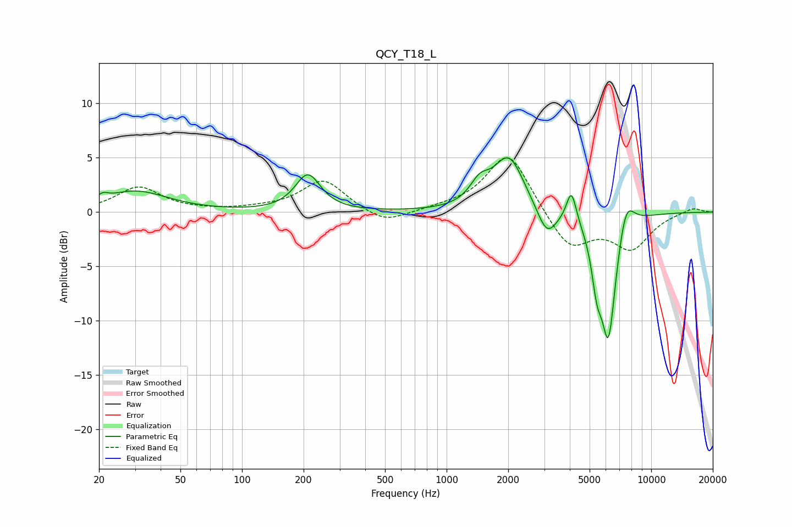

# QCY_T18_L
See [usage instructions](https://github.com/jaakkopasanen/AutoEq#usage) for more options and info.

### Parametric EQs
Apply preamp of -5.1 dB when using parametric equalizer.

|   # | Type    |   Fc (Hz) |    Q |   Gain (dB) |
|-----|---------|-----------|------|-------------|
|   1 | Peaking |        21 | 5.78 |         0.5 |
|   2 | Peaking |        30 | 0.9  |         1.9 |
|   3 | Peaking |       210 | 2.32 |         3.4 |
|   4 | Peaking |      1450 | 2.98 |         1.7 |
|   5 | Peaking |      2015 | 1.87 |         5   |
|   6 | Peaking |      3091 | 2.95 |        -2.6 |
|   7 | Peaking |      4074 | 5.86 |         3   |
|   8 | Peaking |      5421 | 5.6  |        -3.6 |
|   9 | Peaking |      6180 | 3.52 |       -11.6 |
|  10 | Peaking |      7523 | 3.43 |         3.1 |

### Fixed Band EQs
When using fixed band (also called graphic) equalizer, apply preamp of **-5.1 dB** (if available) and set gains manually with these parameters.

|   # | Type    |   Fc (Hz) |    Q |   Gain (dB) |
|-----|---------|-----------|------|-------------|
|   1 | Peaking |        31 | 1.41 |         2.3 |
|   2 | Peaking |        62 | 1.41 |         0.1 |
|   3 | Peaking |       125 | 1.41 |         0.2 |
|   4 | Peaking |       250 | 1.41 |         2.9 |
|   5 | Peaking |       500 | 1.41 |        -1.2 |
|   6 | Peaking |      1000 | 1.41 |         0.3 |
|   7 | Peaking |      2000 | 1.41 |         5.6 |
|   8 | Peaking |      4000 | 1.41 |        -3.5 |
|   9 | Peaking |      8000 | 1.41 |        -3.2 |
|  10 | Peaking |     16000 | 1.41 |         0.5 |

### Graphs

