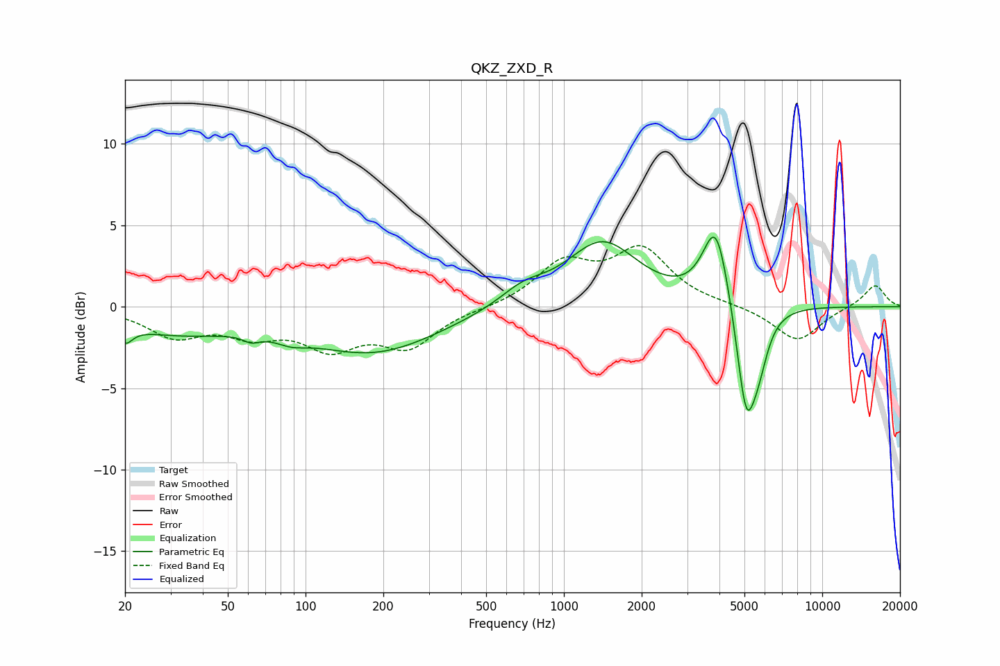

# QKZ_ZXD_R
See [usage instructions](https://github.com/jaakkopasanen/AutoEq#usage) for more options and info.

### Parametric EQs
Apply preamp of -4.4 dB when using parametric equalizer.

|   # | Type    |   Fc (Hz) |    Q |   Gain (dB) |
|-----|---------|-----------|------|-------------|
|   1 | Peaking |        20 | 4.98 |        -1   |
|   2 | Peaking |        31 | 0.6  |        -1.5 |
|   3 | Peaking |        62 | 4.63 |        -0.4 |
|   4 | Peaking |        88 | 2.37 |        -0.5 |
|   5 | Peaking |       183 | 0.55 |        -2.7 |
|   6 | Peaking |       694 | 1.56 |         1   |
|   7 | Peaking |      1408 | 1.03 |         3.9 |
|   8 | Peaking |      3878 | 2.78 |         5.1 |
|   9 | Peaking |      5076 | 3.65 |        -6.7 |
|  10 | Peaking |      5675 | 3.62 |        -2.2 |

### Fixed Band EQs
When using fixed band (also called graphic) equalizer, apply preamp of **-3.8 dB** (if available) and set gains manually with these parameters.

|   # | Type    |   Fc (Hz) |    Q |   Gain (dB) |
|-----|---------|-----------|------|-------------|
|   1 | Peaking |        31 | 1.41 |        -1.7 |
|   2 | Peaking |        62 | 1.41 |        -1.4 |
|   3 | Peaking |       125 | 1.41 |        -2.2 |
|   4 | Peaking |       250 | 1.41 |        -2.3 |
|   5 | Peaking |       500 | 1.41 |        -0.1 |
|   6 | Peaking |      1000 | 1.41 |         2.5 |
|   7 | Peaking |      2000 | 1.41 |         3.3 |
|   8 | Peaking |      4000 | 1.41 |         0.1 |
|   9 | Peaking |      8000 | 1.41 |        -2.1 |
|  10 | Peaking |     16000 | 1.41 |         1.4 |

### Graphs

