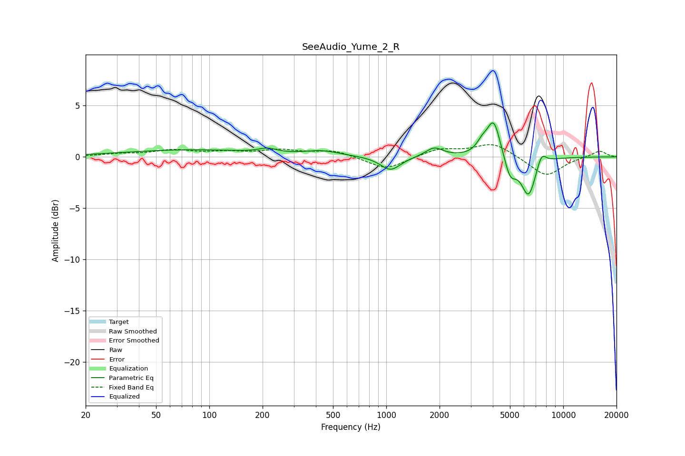

# SeeAudio_Yume_2_R
See [usage instructions](https://github.com/jaakkopasanen/AutoEq#usage) for more options and info.

### Parametric EQs
Apply preamp of -3.4 dB when using parametric equalizer.

|   # | Type    |   Fc (Hz) |    Q |   Gain (dB) |
|-----|---------|-----------|------|-------------|
|   1 | Peaking |        78 | 0.37 |         0.7 |
|   2 | Peaking |       213 | 2.98 |         0.4 |
|   3 | Peaking |       435 | 1.49 |         0.5 |
|   4 | Peaking |      1057 | 2.5  |        -1.4 |
|   5 | Peaking |      1866 | 2.91 |         0.9 |
|   6 | Peaking |      3475 | 4.55 |         0.9 |
|   7 | Peaking |      4050 | 3.66 |         3.7 |
|   8 | Peaking |      5016 | 4.12 |        -2   |
|   9 | Peaking |      6371 | 3.3  |        -3.8 |
|  10 | Peaking |      7535 | 4.97 |         1.3 |

### Fixed Band EQs
When using fixed band (also called graphic) equalizer, apply preamp of **-1.3 dB** (if available) and set gains manually with these parameters.

|   # | Type    |   Fc (Hz) |    Q |   Gain (dB) |
|-----|---------|-----------|------|-------------|
|   1 | Peaking |        31 | 1.41 |         0.2 |
|   2 | Peaking |        62 | 1.41 |         0.6 |
|   3 | Peaking |       125 | 1.41 |         0.4 |
|   4 | Peaking |       250 | 1.41 |         0.6 |
|   5 | Peaking |       500 | 1.41 |         0.6 |
|   6 | Peaking |      1000 | 1.41 |        -1.3 |
|   7 | Peaking |      2000 | 1.41 |         0.8 |
|   8 | Peaking |      4000 | 1.41 |         1.3 |
|   9 | Peaking |      8000 | 1.41 |        -1.9 |
|  10 | Peaking |     16000 | 1.41 |         0.6 |

### Graphs

