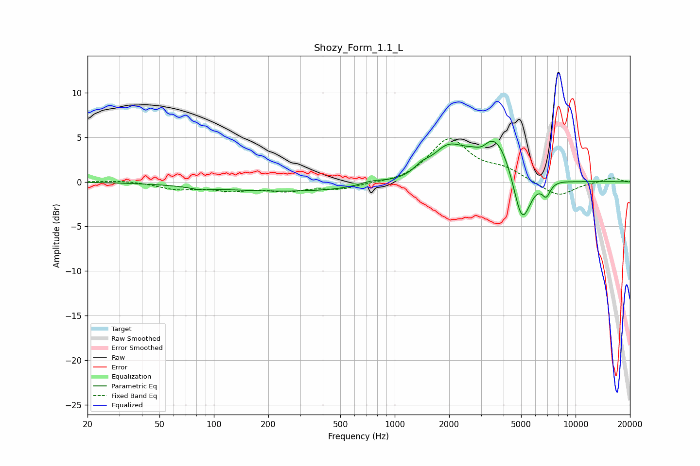

# Shozy_Form_1.1_L
See [usage instructions](https://github.com/jaakkopasanen/AutoEq#usage) for more options and info.

### Parametric EQs
Apply preamp of -4.7 dB when using parametric equalizer.

|   # | Type    |   Fc (Hz) |    Q |   Gain (dB) |
|-----|---------|-----------|------|-------------|
|   1 | Peaking |        85 | 2.74 |        -0.3 |
|   2 | Peaking |       290 | 0.28 |        -1.1 |
|   3 | Peaking |       749 | 1.89 |         0.5 |
|   4 | Peaking |      1410 | 3.37 |         0.8 |
|   5 | Peaking |      1958 | 1.63 |         3   |
|   6 | Peaking |      3042 | 3.54 |        -1   |
|   7 | Peaking |      3551 | 1.28 |         5.7 |
|   8 | Peaking |      5048 | 2.78 |        -6.5 |
|   9 | Peaking |      6885 | 5.89 |        -1.5 |
|  10 | Peaking |     10000 | 1.81 |        -0.1 |

### Fixed Band EQs
When using fixed band (also called graphic) equalizer, apply preamp of **-4.9 dB** (if available) and set gains manually with these parameters.

|   # | Type    |   Fc (Hz) |    Q |   Gain (dB) |
|-----|---------|-----------|------|-------------|
|   1 | Peaking |        31 | 1.41 |         0.2 |
|   2 | Peaking |        62 | 1.41 |        -0.7 |
|   3 | Peaking |       125 | 1.41 |        -0.8 |
|   4 | Peaking |       250 | 1.41 |        -0.9 |
|   5 | Peaking |       500 | 1.41 |        -0.7 |
|   6 | Peaking |      1000 | 1.41 |        -0.2 |
|   7 | Peaking |      2000 | 1.41 |         4.7 |
|   8 | Peaking |      4000 | 1.41 |         1.2 |
|   9 | Peaking |      8000 | 1.41 |        -1.7 |
|  10 | Peaking |     16000 | 1.41 |         0.5 |

### Graphs

