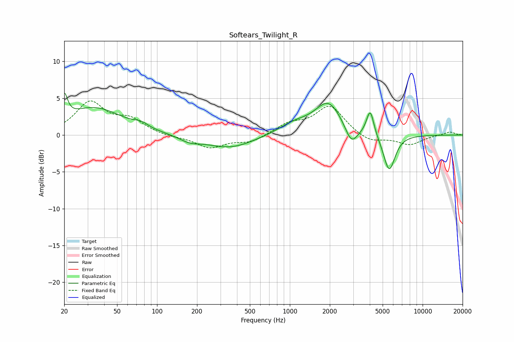

# Softears_Twilight_R
See [usage instructions](https://github.com/jaakkopasanen/AutoEq#usage) for more options and info.

### Parametric EQs
Apply preamp of -5.8 dB when using parametric equalizer.

|   # | Type    |   Fc (Hz) |    Q |   Gain (dB) |
|-----|---------|-----------|------|-------------|
|   1 | Peaking |        20 | 5.83 |         3.3 |
|   2 | Peaking |        34 | 0.67 |         3.7 |
|   3 | Peaking |        76 | 2.75 |         0.6 |
|   4 | Peaking |       175 | 1.88 |        -0.7 |
|   5 | Peaking |       352 | 0.78 |        -1.8 |
|   6 | Peaking |      1076 | 1.15 |         1.3 |
|   7 | Peaking |      1953 | 1.41 |         4.3 |
|   8 | Peaking |      2907 | 3.07 |        -2.5 |
|   9 | Peaking |      4029 | 5.04 |         3.5 |
|  10 | Peaking |      5601 | 3.13 |        -5   |

### Fixed Band EQs
When using fixed band (also called graphic) equalizer, apply preamp of **-4.7 dB** (if available) and set gains manually with these parameters.

|   # | Type    |   Fc (Hz) |    Q |   Gain (dB) |
|-----|---------|-----------|------|-------------|
|   1 | Peaking |        31 | 1.41 |         4.3 |
|   2 | Peaking |        62 | 1.41 |         1.9 |
|   3 | Peaking |       125 | 1.41 |        -0.3 |
|   4 | Peaking |       250 | 1.41 |        -1.7 |
|   5 | Peaking |       500 | 1.41 |        -1   |
|   6 | Peaking |      1000 | 1.41 |         1.4 |
|   7 | Peaking |      2000 | 1.41 |         3.9 |
|   8 | Peaking |      4000 | 1.41 |        -1.1 |
|   9 | Peaking |      8000 | 1.41 |        -1.3 |
|  10 | Peaking |     16000 | 1.41 |         0.5 |

### Graphs

