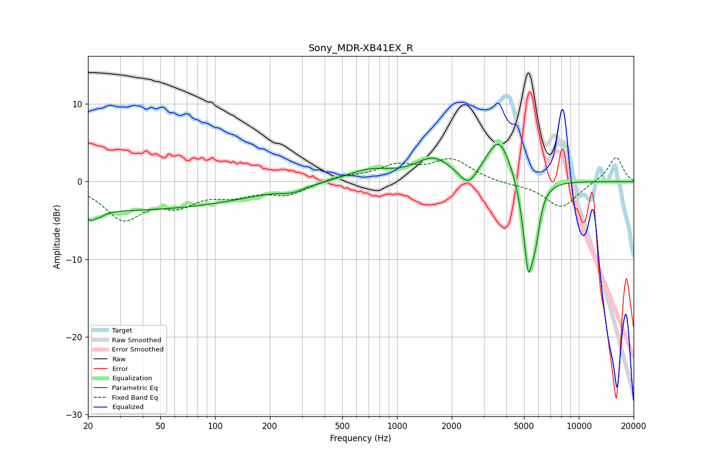

# Sony_MDR-XB41EX_R
See [usage instructions](https://github.com/jaakkopasanen/AutoEq#usage) for more options and info.

### Parametric EQs
Apply preamp of -4.9 dB when using parametric equalizer.

|   # | Type    |   Fc (Hz) |    Q |   Gain (dB) |
|-----|---------|-----------|------|-------------|
|   1 | Peaking |        22 | 4.57 |        -3.4 |
|   2 | Peaking |        22 | 6    |         2.1 |
|   3 | Peaking |        31 | 0.18 |        -3.6 |
|   4 | Peaking |       265 | 2.44 |        -0.6 |
|   5 | Peaking |       699 | 1.13 |         1.5 |
|   6 | Peaking |      1581 | 1.44 |         2.7 |
|   7 | Peaking |      2473 | 2.92 |        -2.3 |
|   8 | Peaking |      3643 | 1.96 |         5.8 |
|   9 | Peaking |      5270 | 4.79 |       -11.8 |
|  10 | Peaking |      5788 | 5.88 |        -4   |

### Fixed Band EQs
When using fixed band (also called graphic) equalizer, apply preamp of **-3.2 dB** (if available) and set gains manually with these parameters.

|   # | Type    |   Fc (Hz) |    Q |   Gain (dB) |
|-----|---------|-----------|------|-------------|
|   1 | Peaking |        31 | 1.41 |        -4.6 |
|   2 | Peaking |        62 | 1.41 |        -2.5 |
|   3 | Peaking |       125 | 1.41 |        -1.4 |
|   4 | Peaking |       250 | 1.41 |        -1.6 |
|   5 | Peaking |       500 | 1.41 |         0.7 |
|   6 | Peaking |      1000 | 1.41 |         1.8 |
|   7 | Peaking |      2000 | 1.41 |         2.7 |
|   8 | Peaking |      4000 | 1.41 |        -0.3 |
|   9 | Peaking |      8000 | 1.41 |        -3.4 |
|  10 | Peaking |     16000 | 1.41 |         3.3 |

### Graphs

