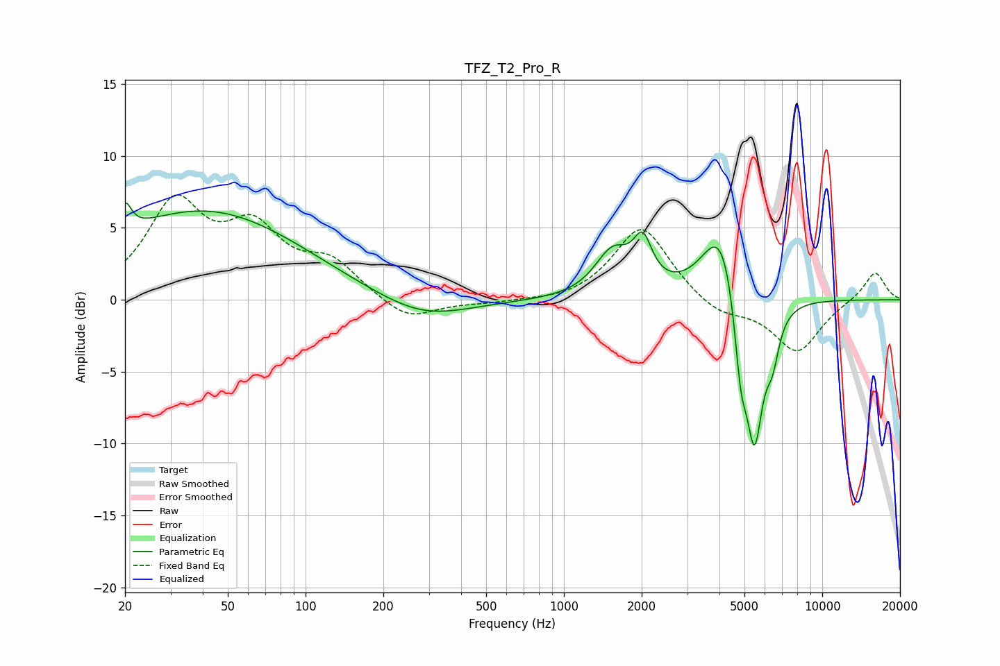

# TFZ_T2_Pro_R
See [usage instructions](https://github.com/jaakkopasanen/AutoEq#usage) for more options and info.

### Parametric EQs
Apply preamp of -6.8 dB when using parametric equalizer.

|   # | Type    |   Fc (Hz) |    Q |   Gain (dB) |
|-----|---------|-----------|------|-------------|
|   1 | Peaking |        20 | 5.94 |         2   |
|   2 | Peaking |        43 | 0.35 |         7.3 |
|   3 | Peaking |        76 | 0.28 |        -1.3 |
|   4 | Peaking |       285 | 0.82 |        -1.4 |
|   5 | Peaking |      1541 | 2.1  |         3   |
|   6 | Peaking |      2019 | 3.91 |         3   |
|   7 | Peaking |      4070 | 1.91 |         5.6 |
|   8 | Peaking |      4837 | 5.64 |        -4.9 |
|   9 | Peaking |      5464 | 3.91 |       -10.4 |
|  10 | Peaking |      6422 | 5.36 |        -2.6 |

### Fixed Band EQs
When using fixed band (also called graphic) equalizer, apply preamp of **-7.4 dB** (if available) and set gains manually with these parameters.

|   # | Type    |   Fc (Hz) |    Q |   Gain (dB) |
|-----|---------|-----------|------|-------------|
|   1 | Peaking |        31 | 1.41 |         6.4 |
|   2 | Peaking |        62 | 1.41 |         4.3 |
|   3 | Peaking |       125 | 1.41 |         2.3 |
|   4 | Peaking |       250 | 1.41 |        -1.6 |
|   5 | Peaking |       500 | 1.41 |        -0.2 |
|   6 | Peaking |      1000 | 1.41 |        -0.2 |
|   7 | Peaking |      2000 | 1.41 |         5.2 |
|   8 | Peaking |      4000 | 1.41 |        -1.1 |
|   9 | Peaking |      8000 | 1.41 |        -3.6 |
|  10 | Peaking |     16000 | 1.41 |         2   |

### Graphs

