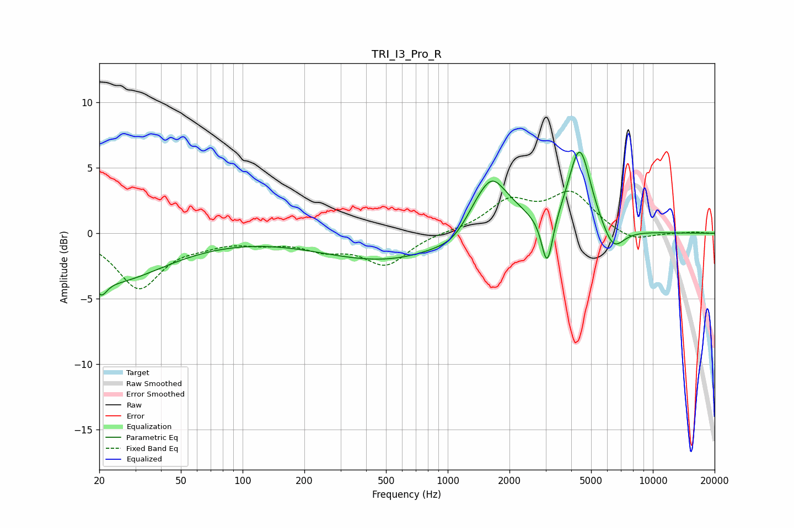

# TRI_I3_Pro_R
See [usage instructions](https://github.com/jaakkopasanen/AutoEq#usage) for more options and info.

### Parametric EQs
Apply preamp of -6.3 dB when using parametric equalizer.

|   # | Type    |   Fc (Hz) |    Q |   Gain (dB) |
|-----|---------|-----------|------|-------------|
|   1 | Peaking |        20 | 5.32 |        -1.1 |
|   2 | Peaking |        21 | 0.32 |        -0.8 |
|   3 | Peaking |        23 | 0.59 |        -2.8 |
|   4 | Peaking |       541 | 0.41 |        -2.2 |
|   5 | Peaking |      1099 | 1.6  |        -1.1 |
|   6 | Peaking |      1576 | 1.16 |         4.6 |
|   7 | Peaking |      1649 | 3    |         0.8 |
|   8 | Peaking |      3054 | 5.16 |        -4   |
|   9 | Peaking |      4398 | 2.57 |         6.5 |
|  10 | Peaking |      6402 | 2.58 |        -2   |

### Fixed Band EQs
When using fixed band (also called graphic) equalizer, apply preamp of **-3.3 dB** (if available) and set gains manually with these parameters.

|   # | Type    |   Fc (Hz) |    Q |   Gain (dB) |
|-----|---------|-----------|------|-------------|
|   1 | Peaking |        31 | 1.41 |        -4.1 |
|   2 | Peaking |        62 | 1.41 |        -0.6 |
|   3 | Peaking |       125 | 1.41 |        -0.5 |
|   4 | Peaking |       250 | 1.41 |        -1   |
|   5 | Peaking |       500 | 1.41 |        -2.3 |
|   6 | Peaking |      1000 | 1.41 |         0.1 |
|   7 | Peaking |      2000 | 1.41 |         2.3 |
|   8 | Peaking |      4000 | 1.41 |         2.9 |
|   9 | Peaking |      8000 | 1.41 |        -0.7 |
|  10 | Peaking |     16000 | 1.41 |         0.1 |

### Graphs

