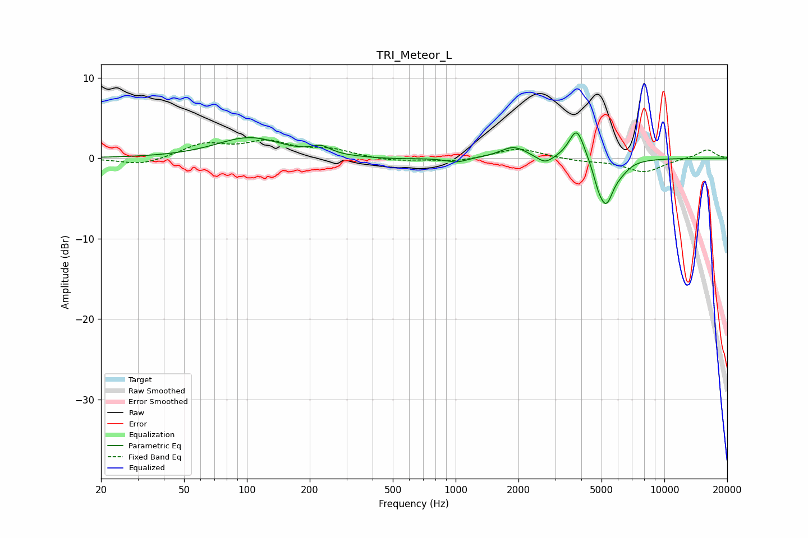

# TRI_Meteor_L
See [usage instructions](https://github.com/jaakkopasanen/AutoEq#usage) for more options and info.

### Parametric EQs
Apply preamp of -3.2 dB when using parametric equalizer.

|   # | Type    |   Fc (Hz) |    Q |   Gain (dB) |
|-----|---------|-----------|------|-------------|
|   1 | Peaking |       102 | 0.91 |         2.5 |
|   2 | Peaking |       227 | 3.27 |         0.9 |
|   3 | Peaking |       491 | 1.05 |        -0.2 |
|   4 | Peaking |      1011 | 2.86 |        -0.6 |
|   5 | Peaking |      1896 | 2.24 |         1.4 |
|   6 | Peaking |      2684 | 3.64 |        -1   |
|   7 | Peaking |      3806 | 3.77 |         4   |
|   8 | Peaking |      4815 | 6    |        -1.3 |
|   9 | Peaking |      5257 | 3.72 |        -5.3 |
|  10 | Peaking |      6235 | 3.59 |        -0.7 |

### Fixed Band EQs
When using fixed band (also called graphic) equalizer, apply preamp of **-2.4 dB** (if available) and set gains manually with these parameters.

|   # | Type    |   Fc (Hz) |    Q |   Gain (dB) |
|-----|---------|-----------|------|-------------|
|   1 | Peaking |        31 | 1.41 |        -0.9 |
|   2 | Peaking |        62 | 1.41 |         1.7 |
|   3 | Peaking |       125 | 1.41 |         1.8 |
|   4 | Peaking |       250 | 1.41 |         1   |
|   5 | Peaking |       500 | 1.41 |        -0.4 |
|   6 | Peaking |      1000 | 1.41 |        -0.4 |
|   7 | Peaking |      2000 | 1.41 |         1.3 |
|   8 | Peaking |      4000 | 1.41 |        -0.3 |
|   9 | Peaking |      8000 | 1.41 |        -1.7 |
|  10 | Peaking |     16000 | 1.41 |         1.1 |

### Graphs

