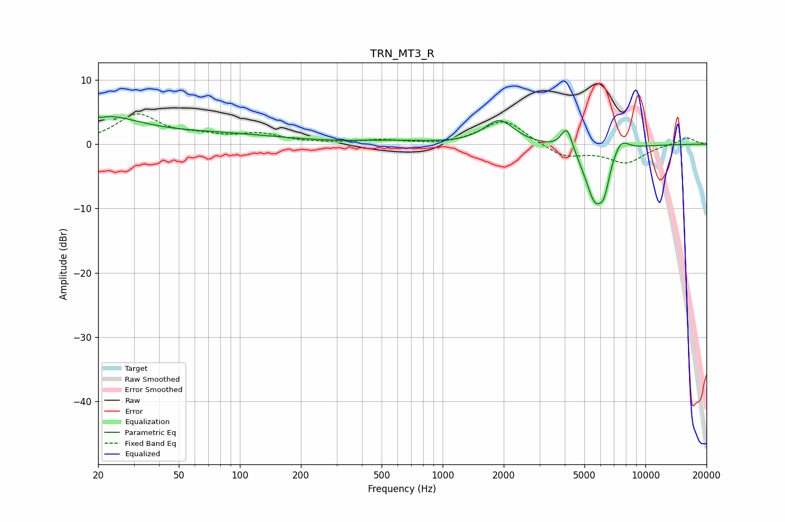

# TRN_MT3_R
See [usage instructions](https://github.com/jaakkopasanen/AutoEq#usage) for more options and info.

### Parametric EQs
Apply preamp of -4.4 dB when using parametric equalizer.

|   # | Type    |   Fc (Hz) |    Q |   Gain (dB) |
|-----|---------|-----------|------|-------------|
|   1 | Peaking |        20 | 5.61 |         3.3 |
|   2 | Peaking |        20 | 5.84 |        -3.4 |
|   3 | Peaking |        21 | 0.74 |         4   |
|   4 | Peaking |        80 | 0.44 |         1.4 |
|   5 | Peaking |       560 | 0.92 |         0.4 |
|   6 | Peaking |      1902 | 1.94 |         3.7 |
|   7 | Peaking |      4098 | 4.9  |         3.9 |
|   8 | Peaking |      5662 | 2.62 |        -9   |
|   9 | Peaking |      6273 | 6    |        -2.9 |
|  10 | Peaking |      7531 | 3.35 |         2.4 |

### Fixed Band EQs
When using fixed band (also called graphic) equalizer, apply preamp of **-4.8 dB** (if available) and set gains manually with these parameters.

|   # | Type    |   Fc (Hz) |    Q |   Gain (dB) |
|-----|---------|-----------|------|-------------|
|   1 | Peaking |        31 | 1.41 |         4.5 |
|   2 | Peaking |        62 | 1.41 |         1   |
|   3 | Peaking |       125 | 1.41 |         1.4 |
|   4 | Peaking |       250 | 1.41 |         0.1 |
|   5 | Peaking |       500 | 1.41 |         0.6 |
|   6 | Peaking |      1000 | 1.41 |        -0.3 |
|   7 | Peaking |      2000 | 1.41 |         3.9 |
|   8 | Peaking |      4000 | 1.41 |        -2   |
|   9 | Peaking |      8000 | 1.41 |        -2.8 |
|  10 | Peaking |     16000 | 1.41 |         1.1 |

### Graphs

