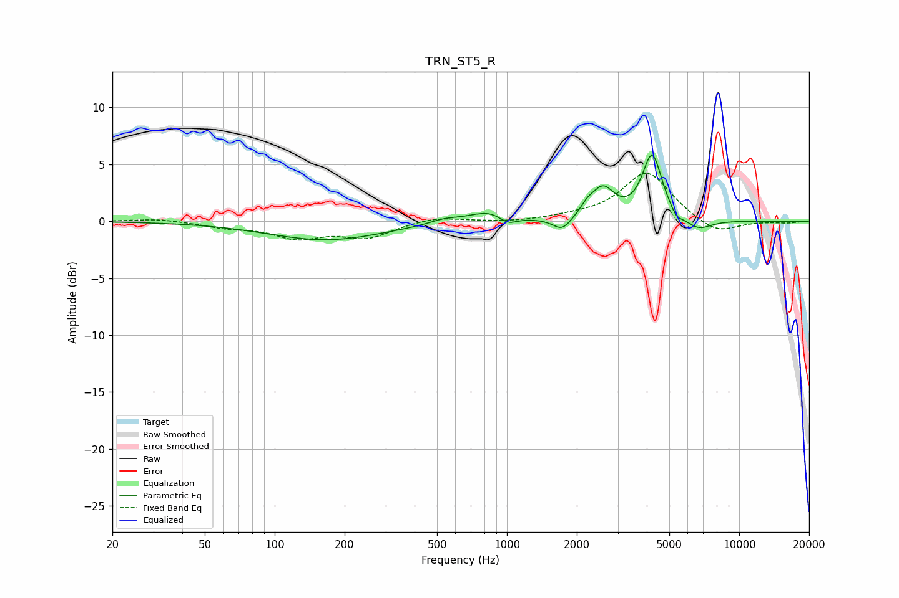

# TRN_ST5_R
See [usage instructions](https://github.com/jaakkopasanen/AutoEq#usage) for more options and info.

### Parametric EQs
Apply preamp of -5.9 dB when using parametric equalizer.

|   # | Type    |   Fc (Hz) |    Q |   Gain (dB) |
|-----|---------|-----------|------|-------------|
|   1 | Peaking |       166 | 0.57 |        -1.6 |
|   2 | Peaking |       538 | 2.19 |         0.4 |
|   3 | Peaking |       839 | 1.67 |         1   |
|   4 | Peaking |      1009 | 3.65 |        -0.7 |
|   5 | Peaking |      1727 | 3.67 |        -1.1 |
|   6 | Peaking |      2216 | 5.15 |         0.6 |
|   7 | Peaking |      2587 | 2.88 |         2.6 |
|   8 | Peaking |      4219 | 3.34 |         5.7 |
|   9 | Peaking |      5370 | 6    |        -0.6 |
|  10 | Peaking |      6654 | 2.4  |        -1   |

### Fixed Band EQs
When using fixed band (also called graphic) equalizer, apply preamp of **-4.3 dB** (if available) and set gains manually with these parameters.

|   # | Type    |   Fc (Hz) |    Q |   Gain (dB) |
|-----|---------|-----------|------|-------------|
|   1 | Peaking |        31 | 1.41 |         0.3 |
|   2 | Peaking |        62 | 1.41 |        -0.5 |
|   3 | Peaking |       125 | 1.41 |        -1.3 |
|   4 | Peaking |       250 | 1.41 |        -1.3 |
|   5 | Peaking |       500 | 1.41 |         0.4 |
|   6 | Peaking |      1000 | 1.41 |        -0.1 |
|   7 | Peaking |      2000 | 1.41 |         0.3 |
|   8 | Peaking |      4000 | 1.41 |         4.3 |
|   9 | Peaking |      8000 | 1.41 |        -1.2 |
|  10 | Peaking |     16000 | 1.41 |        -0.1 |

### Graphs

