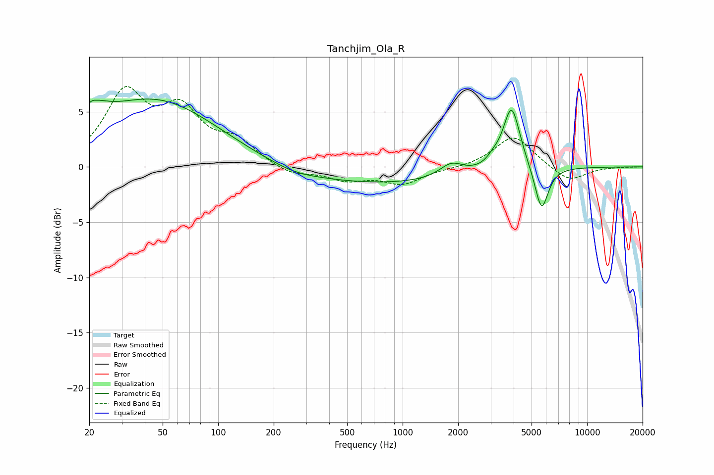

# Tanchjim_Ola_R
See [usage instructions](https://github.com/jaakkopasanen/AutoEq#usage) for more options and info.

### Parametric EQs
Apply preamp of -6.2 dB when using parametric equalizer.

|   # | Type    |   Fc (Hz) |    Q |   Gain (dB) |
|-----|---------|-----------|------|-------------|
|   1 | Peaking |        20 | 5.98 |        -2.8 |
|   2 | Peaking |        20 | 5.86 |         3.2 |
|   3 | Peaking |        21 | 1.79 |         1.7 |
|   4 | Peaking |        45 | 0.42 |         6   |
|   5 | Peaking |       258 | 1.2  |        -0.4 |
|   6 | Peaking |       744 | 0.28 |        -1.5 |
|   7 | Peaking |      1835 | 2.2  |         1.2 |
|   8 | Peaking |      3092 | 4.46 |         0.5 |
|   9 | Peaking |      3895 | 3.04 |         5.8 |
|  10 | Peaking |      5665 | 3.77 |        -4.1 |

### Fixed Band EQs
When using fixed band (also called graphic) equalizer, apply preamp of **-7.4 dB** (if available) and set gains manually with these parameters.

|   # | Type    |   Fc (Hz) |    Q |   Gain (dB) |
|-----|---------|-----------|------|-------------|
|   1 | Peaking |        31 | 1.41 |         6.3 |
|   2 | Peaking |        62 | 1.41 |         4.5 |
|   3 | Peaking |       125 | 1.41 |         2   |
|   4 | Peaking |       250 | 1.41 |        -0.8 |
|   5 | Peaking |       500 | 1.41 |        -1.1 |
|   6 | Peaking |      1000 | 1.41 |        -1.5 |
|   7 | Peaking |      2000 | 1.41 |        -0.1 |
|   8 | Peaking |      4000 | 1.41 |         2.9 |
|   9 | Peaking |      8000 | 1.41 |        -1.4 |
|  10 | Peaking |     16000 | 1.41 |         0   |

### Graphs

