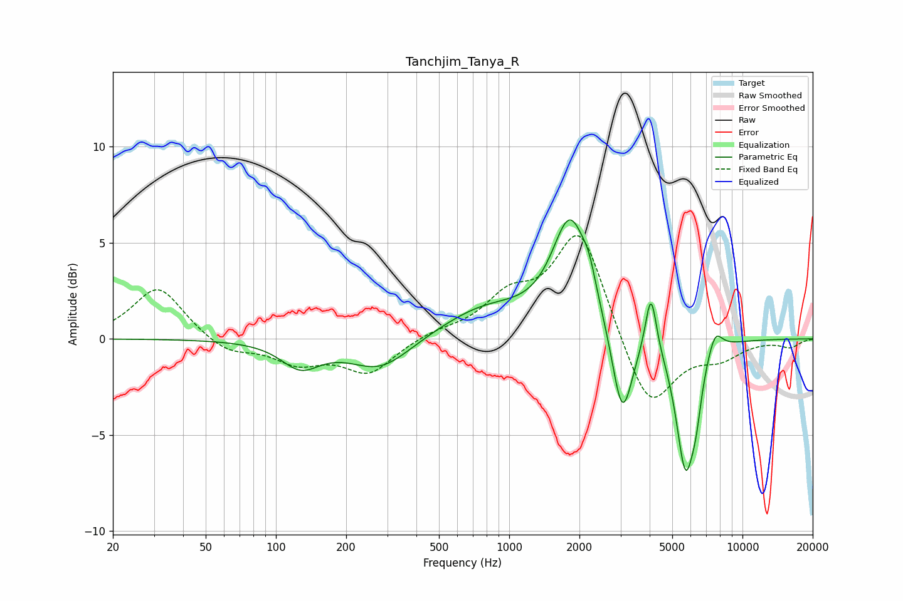

# Tanchjim_Tanya_R
See [usage instructions](https://github.com/jaakkopasanen/AutoEq#usage) for more options and info.

### Parametric EQs
Apply preamp of -6.3 dB when using parametric equalizer.

|   # | Type    |   Fc (Hz) |    Q |   Gain (dB) |
|-----|---------|-----------|------|-------------|
|   1 | Peaking |       128 | 1.7  |        -1.3 |
|   2 | Peaking |       280 | 1.07 |        -1.7 |
|   3 | Peaking |       788 | 0.74 |         1.5 |
|   4 | Peaking |      1828 | 1.82 |         5.9 |
|   5 | Peaking |      2205 | 4.81 |         1   |
|   6 | Peaking |      3054 | 3.26 |        -4.7 |
|   7 | Peaking |      4052 | 5.96 |         3.2 |
|   8 | Peaking |      5703 | 3.38 |        -6.7 |
|   9 | Peaking |      6335 | 6    |        -1.5 |
|  10 | Peaking |      7622 | 4.23 |         1.2 |

### Fixed Band EQs
When using fixed band (also called graphic) equalizer, apply preamp of **-5.5 dB** (if available) and set gains manually with these parameters.

|   # | Type    |   Fc (Hz) |    Q |   Gain (dB) |
|-----|---------|-----------|------|-------------|
|   1 | Peaking |        31 | 1.41 |         2.7 |
|   2 | Peaking |        62 | 1.41 |        -0.8 |
|   3 | Peaking |       125 | 1.41 |        -1.1 |
|   4 | Peaking |       250 | 1.41 |        -1.7 |
|   5 | Peaking |       500 | 1.41 |         0.3 |
|   6 | Peaking |      1000 | 1.41 |         1.9 |
|   7 | Peaking |      2000 | 1.41 |         5.7 |
|   8 | Peaking |      4000 | 1.41 |        -3.9 |
|   9 | Peaking |      8000 | 1.41 |        -0.9 |
|  10 | Peaking |     16000 | 1.41 |        -0.4 |

### Graphs

