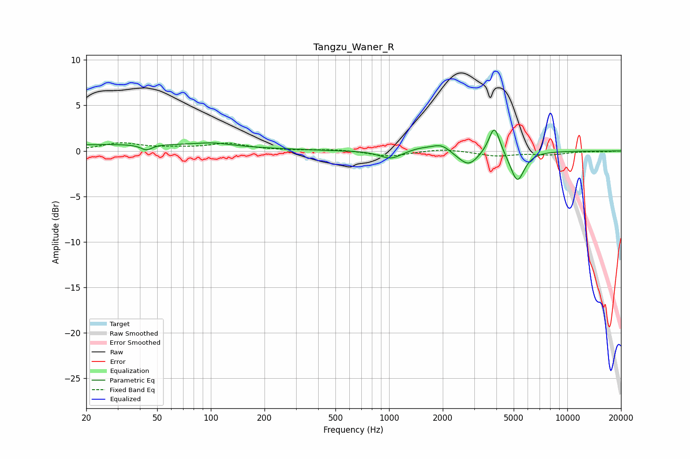

# Tangzu_Waner_R
See [usage instructions](https://github.com/jaakkopasanen/AutoEq#usage) for more options and info.

### Parametric EQs
Apply preamp of -2.4 dB when using parametric equalizer.

|   # | Type    |   Fc (Hz) |    Q |   Gain (dB) |
|-----|---------|-----------|------|-------------|
|   1 | Peaking |        35 | 0.2  |         0.7 |
|   2 | Peaking |        44 | 4.49 |        -0.6 |
|   3 | Peaking |       103 | 1.64 |         0.3 |
|   4 | Peaking |      1023 | 2.3  |        -0.9 |
|   5 | Peaking |      1484 | 1.92 |         0.4 |
|   6 | Peaking |      1971 | 2.63 |         0.9 |
|   7 | Peaking |      2464 | 2.28 |        -0.3 |
|   8 | Peaking |      2810 | 2.76 |        -1.4 |
|   9 | Peaking |      3896 | 4.59 |         3.1 |
|  10 | Peaking |      5242 | 3.6  |        -3.4 |

### Fixed Band EQs
When using fixed band (also called graphic) equalizer, apply preamp of **-1.0 dB** (if available) and set gains manually with these parameters.

|   # | Type    |   Fc (Hz) |    Q |   Gain (dB) |
|-----|---------|-----------|------|-------------|
|   1 | Peaking |        31 | 1.41 |         0.8 |
|   2 | Peaking |        62 | 1.41 |         0.2 |
|   3 | Peaking |       125 | 1.41 |         0.8 |
|   4 | Peaking |       250 | 1.41 |         0   |
|   5 | Peaking |       500 | 1.41 |         0.2 |
|   6 | Peaking |      1000 | 1.41 |        -0.6 |
|   7 | Peaking |      2000 | 1.41 |         0.3 |
|   8 | Peaking |      4000 | 1.41 |        -0.5 |
|   9 | Peaking |      8000 | 1.41 |        -0.4 |
|  10 | Peaking |     16000 | 1.41 |        -0.1 |

### Graphs

