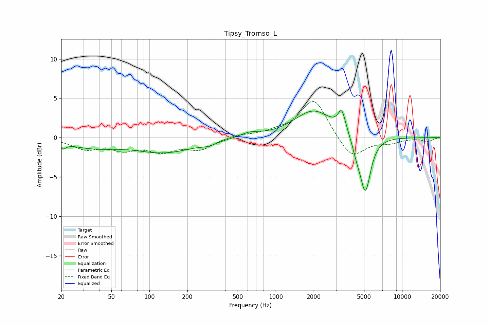

# Tipsy_Tromso_L
See [usage instructions](https://github.com/jaakkopasanen/AutoEq#usage) for more options and info.

### Parametric EQs
Apply preamp of -3.5 dB when using parametric equalizer.

|   # | Type    |   Fc (Hz) |    Q |   Gain (dB) |
|-----|---------|-----------|------|-------------|
|   1 | Peaking |        21 | 4.97 |         0.6 |
|   2 | Peaking |        21 | 5.76 |        -1.2 |
|   3 | Peaking |        35 | 0.72 |        -1.1 |
|   4 | Peaking |       132 | 0.61 |        -1.8 |
|   5 | Peaking |       292 | 2.3  |        -0.4 |
|   6 | Peaking |       621 | 1.93 |         0.6 |
|   7 | Peaking |      1996 | 0.93 |         3.4 |
|   8 | Peaking |      3336 | 4.74 |         2.6 |
|   9 | Peaking |      4367 | 4.51 |        -1.3 |
|  10 | Peaking |      5117 | 3.26 |        -7.1 |

### Fixed Band EQs
When using fixed band (also called graphic) equalizer, apply preamp of **-4.7 dB** (if available) and set gains manually with these parameters.

|   # | Type    |   Fc (Hz) |    Q |   Gain (dB) |
|-----|---------|-----------|------|-------------|
|   1 | Peaking |        31 | 1.41 |        -1.3 |
|   2 | Peaking |        62 | 1.41 |        -1.3 |
|   3 | Peaking |       125 | 1.41 |        -1.5 |
|   4 | Peaking |       250 | 1.41 |        -1.4 |
|   5 | Peaking |       500 | 1.41 |         0.4 |
|   6 | Peaking |      1000 | 1.41 |         0.5 |
|   7 | Peaking |      2000 | 1.41 |         5   |
|   8 | Peaking |      4000 | 1.41 |        -2.8 |
|   9 | Peaking |      8000 | 1.41 |        -0.6 |
|  10 | Peaking |     16000 | 1.41 |        -0.4 |

### Graphs

