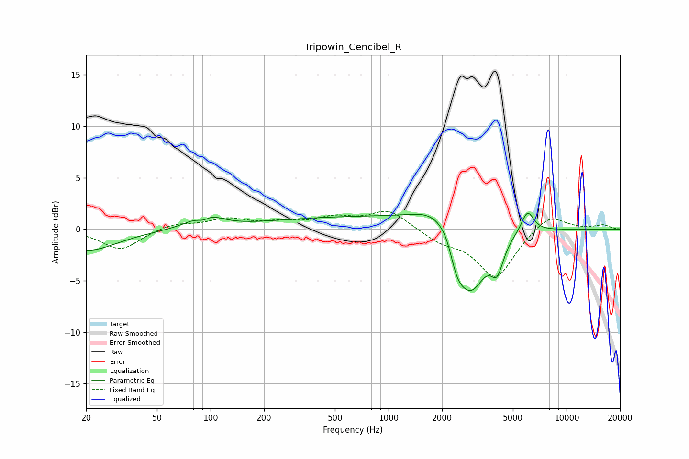

# Tripowin_Cencibel_R
See [usage instructions](https://github.com/jaakkopasanen/AutoEq#usage) for more options and info.

### Parametric EQs
Apply preamp of -1.6 dB when using parametric equalizer.

|   # | Type    |   Fc (Hz) |    Q |   Gain (dB) |
|-----|---------|-----------|------|-------------|
|   1 | Peaking |        20 | 0.81 |        -2.1 |
|   2 | Peaking |        91 | 3.28 |        -1.1 |
|   3 | Peaking |        93 | 1.89 |         1.9 |
|   4 | Peaking |       802 | 0.23 |         1.2 |
|   5 | Peaking |      1908 | 1.17 |         2   |
|   6 | Peaking |      2169 | 3.21 |         1.1 |
|   7 | Peaking |      2398 | 2.91 |        -3.2 |
|   8 | Peaking |      2919 | 1.66 |        -6.3 |
|   9 | Peaking |      4078 | 3.95 |        -2.8 |
|  10 | Peaking |      6037 | 3.94 |         2.1 |

### Fixed Band EQs
When using fixed band (also called graphic) equalizer, apply preamp of **-1.8 dB** (if available) and set gains manually with these parameters.

|   # | Type    |   Fc (Hz) |    Q |   Gain (dB) |
|-----|---------|-----------|------|-------------|
|   1 | Peaking |        31 | 1.41 |        -2   |
|   2 | Peaking |        62 | 1.41 |         0.6 |
|   3 | Peaking |       125 | 1.41 |         0.9 |
|   4 | Peaking |       250 | 1.41 |         0.5 |
|   5 | Peaking |       500 | 1.41 |         1   |
|   6 | Peaking |      1000 | 1.41 |         1.8 |
|   7 | Peaking |      2000 | 1.41 |        -1.1 |
|   8 | Peaking |      4000 | 1.41 |        -4.7 |
|   9 | Peaking |      8000 | 1.41 |         1.6 |
|  10 | Peaking |     16000 | 1.41 |         0.4 |

### Graphs

