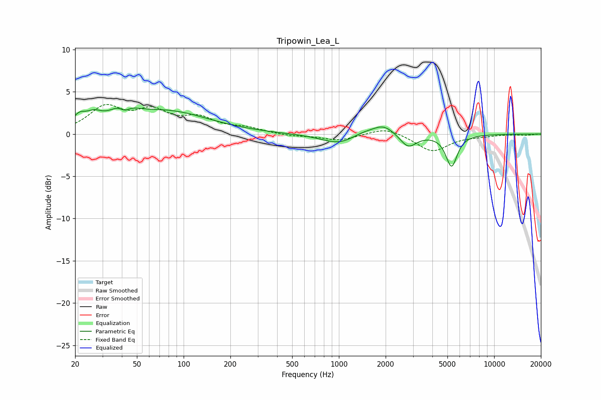

# Tripowin_Lea_L
See [usage instructions](https://github.com/jaakkopasanen/AutoEq#usage) for more options and info.

### Parametric EQs
Apply preamp of -3.2 dB when using parametric equalizer.

|   # | Type    |   Fc (Hz) |    Q |   Gain (dB) |
|-----|---------|-----------|------|-------------|
|   1 | Peaking |        21 | 3.43 |         1.3 |
|   2 | Peaking |        26 | 2.69 |         1.2 |
|   3 | Peaking |        41 | 2.28 |         2.9 |
|   4 | Peaking |        42 | 3.46 |        -2   |
|   5 | Peaking |        77 | 0.52 |         2.6 |
|   6 | Peaking |      1021 | 1.19 |        -1.3 |
|   7 | Peaking |      1413 | 1.62 |         0.6 |
|   8 | Peaking |      1943 | 2    |         1.2 |
|   9 | Peaking |      2794 | 2.7  |        -1.6 |
|  10 | Peaking |      5316 | 3.83 |        -3.7 |

### Fixed Band EQs
When using fixed band (also called graphic) equalizer, apply preamp of **-3.6 dB** (if available) and set gains manually with these parameters.

|   # | Type    |   Fc (Hz) |    Q |   Gain (dB) |
|-----|---------|-----------|------|-------------|
|   1 | Peaking |        31 | 1.41 |         3   |
|   2 | Peaking |        62 | 1.41 |         2.4 |
|   3 | Peaking |       125 | 1.41 |         1.6 |
|   4 | Peaking |       250 | 1.41 |         0.6 |
|   5 | Peaking |       500 | 1.41 |        -0.2 |
|   6 | Peaking |      1000 | 1.41 |        -0.8 |
|   7 | Peaking |      2000 | 1.41 |         0.9 |
|   8 | Peaking |      4000 | 1.41 |        -2.1 |
|   9 | Peaking |      8000 | 1.41 |        -0.2 |
|  10 | Peaking |     16000 | 1.41 |        -0.1 |

### Graphs

