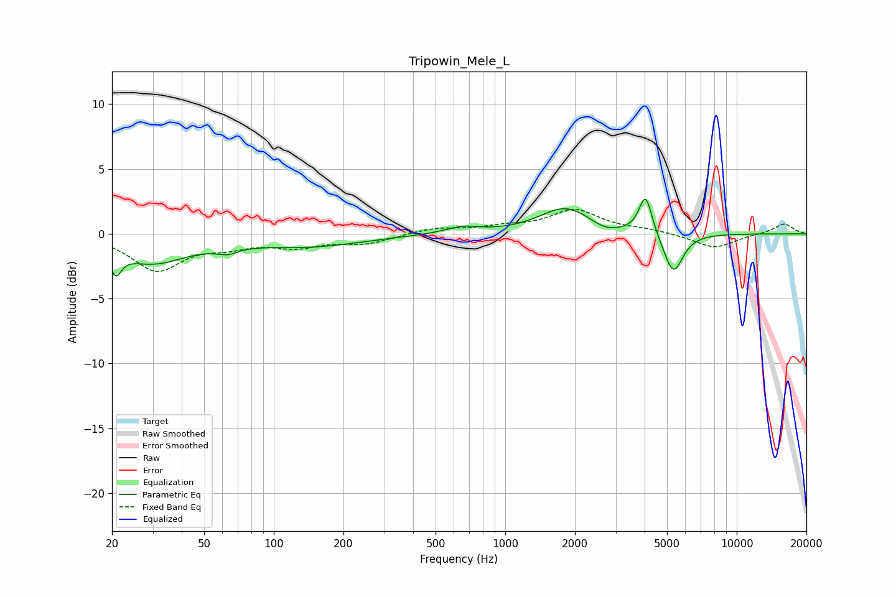

# Tripowin_Mele_L
See [usage instructions](https://github.com/jaakkopasanen/AutoEq#usage) for more options and info.

### Parametric EQs
Apply preamp of -2.8 dB when using parametric equalizer.

|   # | Type    |   Fc (Hz) |    Q |   Gain (dB) |
|-----|---------|-----------|------|-------------|
|   1 | Peaking |        21 | 5.99 |        -1.7 |
|   2 | Peaking |        30 | 0.92 |        -2.1 |
|   3 | Peaking |        67 | 2.53 |        -1.1 |
|   4 | Peaking |        70 | 3    |         0.6 |
|   5 | Peaking |       146 | 0.62 |        -0.9 |
|   6 | Peaking |       653 | 1.9  |         0.5 |
|   7 | Peaking |      1822 | 1.26 |         2   |
|   8 | Peaking |      2696 | 2.49 |        -0.5 |
|   9 | Peaking |      4037 | 5.01 |         3.1 |
|  10 | Peaking |      5322 | 3.36 |        -3.2 |

### Fixed Band EQs
When using fixed band (also called graphic) equalizer, apply preamp of **-2.0 dB** (if available) and set gains manually with these parameters.

|   # | Type    |   Fc (Hz) |    Q |   Gain (dB) |
|-----|---------|-----------|------|-------------|
|   1 | Peaking |        31 | 1.41 |        -2.7 |
|   2 | Peaking |        62 | 1.41 |        -0.7 |
|   3 | Peaking |       125 | 1.41 |        -0.9 |
|   4 | Peaking |       250 | 1.41 |        -0.7 |
|   5 | Peaking |       500 | 1.41 |         0.4 |
|   6 | Peaking |      1000 | 1.41 |         0.4 |
|   7 | Peaking |      2000 | 1.41 |         1.8 |
|   8 | Peaking |      4000 | 1.41 |         0.3 |
|   9 | Peaking |      8000 | 1.41 |        -1.1 |
|  10 | Peaking |     16000 | 1.41 |         0.8 |

### Graphs

