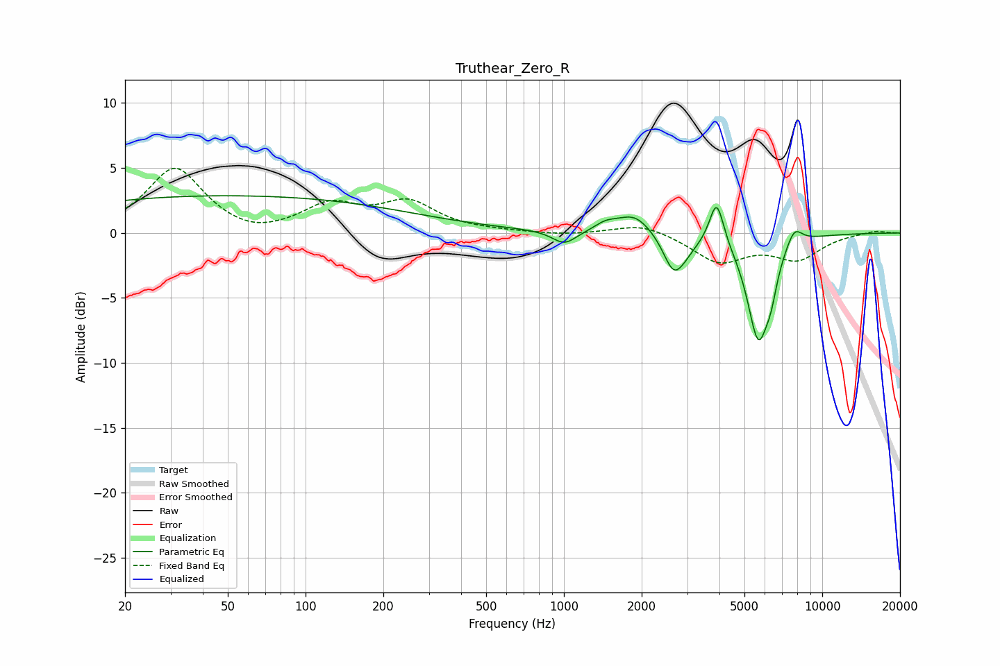

# Truthear_Zero_R
See [usage instructions](https://github.com/jaakkopasanen/AutoEq#usage) for more options and info.

### Parametric EQs
Apply preamp of -3.0 dB when using parametric equalizer.

|   # | Type    |   Fc (Hz) |    Q |   Gain (dB) |
|-----|---------|-----------|------|-------------|
|   1 | Peaking |        49 | 0.18 |         2.9 |
|   2 | Peaking |      1004 | 3.02 |        -1.1 |
|   3 | Peaking |      1454 | 3.27 |         0.5 |
|   4 | Peaking |      1878 | 2.09 |         1.5 |
|   5 | Peaking |      2651 | 3.6  |        -2.4 |
|   6 | Peaking |      2893 | 2.7  |        -1   |
|   7 | Peaking |      3901 | 5.13 |         3.5 |
|   8 | Peaking |      5660 | 3.15 |        -8   |
|   9 | Peaking |      6344 | 6    |        -1.6 |
|  10 | Peaking |      7789 | 4.26 |         1.4 |

### Fixed Band EQs
When using fixed band (also called graphic) equalizer, apply preamp of **-5.1 dB** (if available) and set gains manually with these parameters.

|   # | Type    |   Fc (Hz) |    Q |   Gain (dB) |
|-----|---------|-----------|------|-------------|
|   1 | Peaking |        31 | 1.41 |         5   |
|   2 | Peaking |        62 | 1.41 |        -0.5 |
|   3 | Peaking |       125 | 1.41 |         2   |
|   4 | Peaking |       250 | 1.41 |         2.2 |
|   5 | Peaking |       500 | 1.41 |         0.1 |
|   6 | Peaking |      1000 | 1.41 |        -0.2 |
|   7 | Peaking |      2000 | 1.41 |         0.8 |
|   8 | Peaking |      4000 | 1.41 |        -2.2 |
|   9 | Peaking |      8000 | 1.41 |        -1.9 |
|  10 | Peaking |     16000 | 1.41 |         0.2 |

### Graphs

