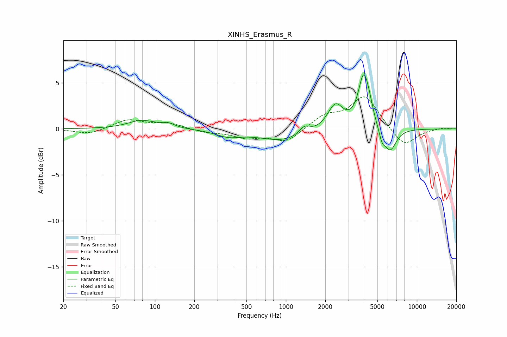

# XINHS_Erasmus_R
See [usage instructions](https://github.com/jaakkopasanen/AutoEq#usage) for more options and info.

### Parametric EQs
Apply preamp of -6.0 dB when using parametric equalizer.

|   # | Type    |   Fc (Hz) |    Q |   Gain (dB) |
|-----|---------|-----------|------|-------------|
|   1 | Peaking |        79 | 1.38 |         0.9 |
|   2 | Peaking |       126 | 2.86 |         0.4 |
|   3 | Peaking |       362 | 1.52 |        -0.6 |
|   4 | Peaking |       980 | 0.72 |        -1.3 |
|   5 | Peaking |      1387 | 3.34 |         0.9 |
|   6 | Peaking |      2386 | 2.35 |         2.7 |
|   7 | Peaking |      3923 | 3.48 |         5.5 |
|   8 | Peaking |      4352 | 4.94 |         0.9 |
|   9 | Peaking |      5420 | 6    |        -1.2 |
|  10 | Peaking |      6249 | 2.95 |        -2.5 |

### Fixed Band EQs
When using fixed band (also called graphic) equalizer, apply preamp of **-3.6 dB** (if available) and set gains manually with these parameters.

|   # | Type    |   Fc (Hz) |    Q |   Gain (dB) |
|-----|---------|-----------|------|-------------|
|   1 | Peaking |        31 | 1.41 |        -0.6 |
|   2 | Peaking |        62 | 1.41 |         1   |
|   3 | Peaking |       125 | 1.41 |         0.6 |
|   4 | Peaking |       250 | 1.41 |        -0.4 |
|   5 | Peaking |       500 | 1.41 |        -0.9 |
|   6 | Peaking |      1000 | 1.41 |        -1.4 |
|   7 | Peaking |      2000 | 1.41 |         1.3 |
|   8 | Peaking |      4000 | 1.41 |         3.6 |
|   9 | Peaking |      8000 | 1.41 |        -2   |
|  10 | Peaking |     16000 | 1.41 |         0.1 |

### Graphs

