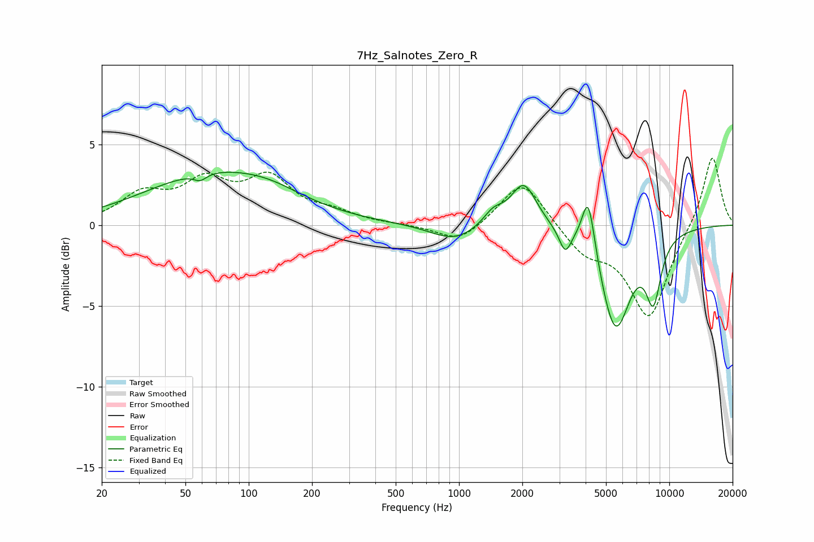

# 7Hz_Salnotes_Zero_R
See [usage instructions](https://github.com/jaakkopasanen/AutoEq#usage) for more options and info.

### Parametric EQs
Apply preamp of -3.4 dB when using parametric equalizer.

|   # | Type    |   Fc (Hz) |    Q |   Gain (dB) |
|-----|---------|-----------|------|-------------|
|   1 | Peaking |        59 | 4.72 |        -0.4 |
|   2 | Peaking |        69 | 0.43 |         3.1 |
|   3 | Peaking |       127 | 0.98 |         0.4 |
|   4 | Peaking |       949 | 1.27 |        -1   |
|   5 | Peaking |      1454 | 2.95 |         0.8 |
|   6 | Peaking |      2032 | 2.3  |         2.7 |
|   7 | Peaking |      3199 | 5.04 |        -1.4 |
|   8 | Peaking |      4121 | 4.49 |         3.7 |
|   9 | Peaking |      5537 | 1.9  |        -6.4 |
|  10 | Peaking |      8404 | 3.65 |        -3.7 |

### Fixed Band EQs
When using fixed band (also called graphic) equalizer, apply preamp of **-4.2 dB** (if available) and set gains manually with these parameters.

|   # | Type    |   Fc (Hz) |    Q |   Gain (dB) |
|-----|---------|-----------|------|-------------|
|   1 | Peaking |        31 | 1.41 |         1.7 |
|   2 | Peaking |        62 | 1.41 |         2.4 |
|   3 | Peaking |       125 | 1.41 |         2.7 |
|   4 | Peaking |       250 | 1.41 |         0.6 |
|   5 | Peaking |       500 | 1.41 |         0   |
|   6 | Peaking |      1000 | 1.41 |        -1.2 |
|   7 | Peaking |      2000 | 1.41 |         2.9 |
|   8 | Peaking |      4000 | 1.41 |        -1.6 |
|   9 | Peaking |      8000 | 1.41 |        -5.7 |
|  10 | Peaking |     16000 | 1.41 |         4.5 |

### Graphs

