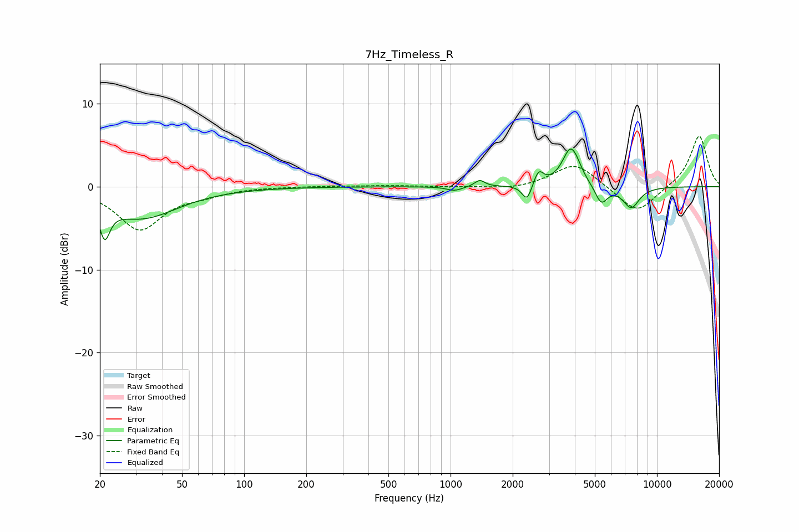

# 7Hz_Timeless_R
See [usage instructions](https://github.com/jaakkopasanen/AutoEq#usage) for more options and info.

### Parametric EQs
Apply preamp of -4.6 dB when using parametric equalizer.

|   # | Type    |   Fc (Hz) |    Q |   Gain (dB) |
|-----|---------|-----------|------|-------------|
|   1 | Peaking |        21 | 5.76 |        -3.8 |
|   2 | Peaking |        32 | 0.8  |        -3.7 |
|   3 | Peaking |      1046 | 3.75 |        -0.5 |
|   4 | Peaking |      1383 | 6    |         0.8 |
|   5 | Peaking |      2348 | 5.99 |        -2.1 |
|   6 | Peaking |      2669 | 6    |         1.8 |
|   7 | Peaking |      3810 | 3.46 |         4.4 |
|   8 | Peaking |      4087 | 4.62 |         0.6 |
|   9 | Peaking |      5373 | 4.7  |        -2.2 |
|  10 | Peaking |      7501 | 3.36 |        -2.5 |

### Fixed Band EQs
When using fixed band (also called graphic) equalizer, apply preamp of **-6.2 dB** (if available) and set gains manually with these parameters.

|   # | Type    |   Fc (Hz) |    Q |   Gain (dB) |
|-----|---------|-----------|------|-------------|
|   1 | Peaking |        31 | 1.41 |        -5.1 |
|   2 | Peaking |        62 | 1.41 |        -0.7 |
|   3 | Peaking |       125 | 1.41 |         0   |
|   4 | Peaking |       250 | 1.41 |         0.1 |
|   5 | Peaking |       500 | 1.41 |         0.1 |
|   6 | Peaking |      1000 | 1.41 |        -0   |
|   7 | Peaking |      2000 | 1.41 |        -0.4 |
|   8 | Peaking |      4000 | 1.41 |         2.9 |
|   9 | Peaking |      8000 | 1.41 |        -3.3 |
|  10 | Peaking |     16000 | 1.41 |         6.2 |

### Graphs

