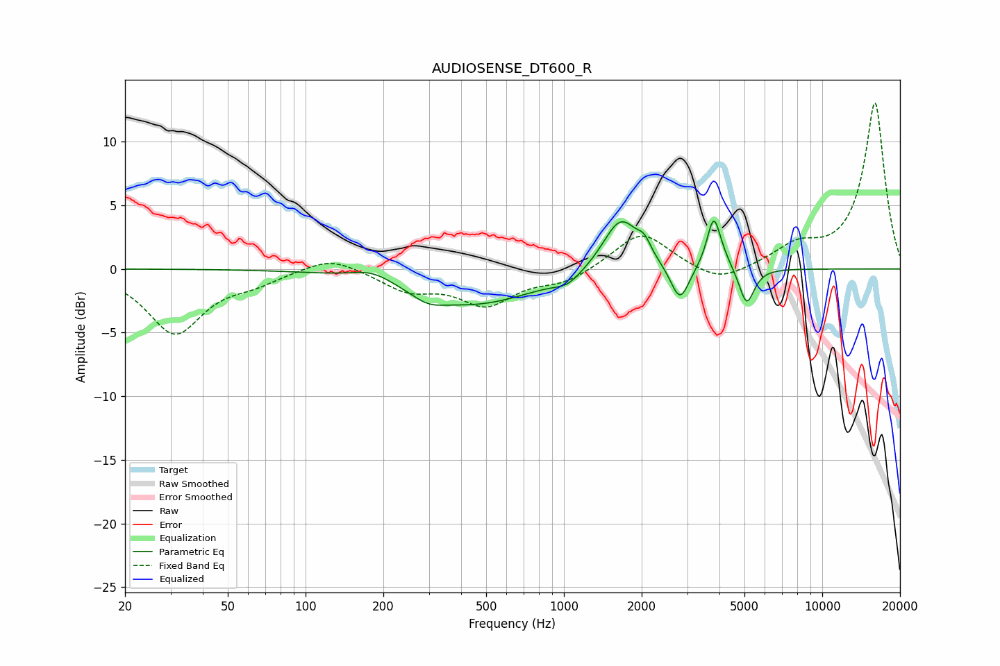

# AUDIOSENSE_DT600_R
See [usage instructions](https://github.com/jaakkopasanen/AutoEq#usage) for more options and info.

### Parametric EQs
Apply preamp of -3.9 dB when using parametric equalizer.

|   # | Type    |   Fc (Hz) |    Q |   Gain (dB) |
|-----|---------|-----------|------|-------------|
|   1 | Peaking |       182 | 1.73 |         0.9 |
|   2 | Peaking |       298 | 2.31 |        -0.7 |
|   3 | Peaking |       447 | 0.57 |        -2.8 |
|   4 | Peaking |      1034 | 2.78 |        -0.7 |
|   5 | Peaking |      1660 | 2.04 |         4.3 |
|   6 | Peaking |      2045 | 5.5  |         1   |
|   7 | Peaking |      2813 | 3.95 |        -2.9 |
|   8 | Peaking |      3795 | 5.81 |         3.3 |
|   9 | Peaking |      3953 | 3.31 |         1   |
|  10 | Peaking |      5098 | 4.82 |        -3   |

### Fixed Band EQs
When using fixed band (also called graphic) equalizer, apply preamp of **-13.1 dB** (if available) and set gains manually with these parameters.

|   # | Type    |   Fc (Hz) |    Q |   Gain (dB) |
|-----|---------|-----------|------|-------------|
|   1 | Peaking |        31 | 1.41 |        -5   |
|   2 | Peaking |        62 | 1.41 |        -0.9 |
|   3 | Peaking |       125 | 1.41 |         1.1 |
|   4 | Peaking |       250 | 1.41 |        -1.5 |
|   5 | Peaking |       500 | 1.41 |        -2.7 |
|   6 | Peaking |      1000 | 1.41 |        -1   |
|   7 | Peaking |      2000 | 1.41 |         3   |
|   8 | Peaking |      4000 | 1.41 |        -1.3 |
|   9 | Peaking |      8000 | 1.41 |         1.6 |
|  10 | Peaking |     16000 | 1.41 |        13.1 |

### Graphs

