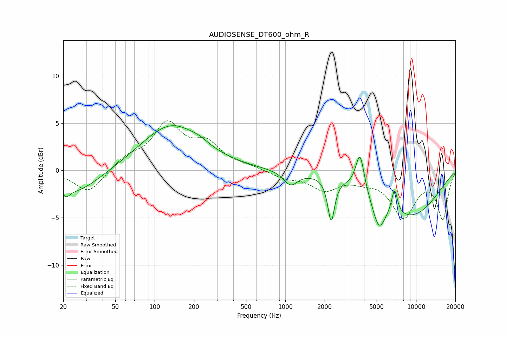

# AUDIOSENSE_DT600_ohm_R
See [usage instructions](https://github.com/jaakkopasanen/AutoEq#usage) for more options and info.

### Parametric EQs
Apply preamp of -4.8 dB when using parametric equalizer.

|   # | Type    |   Fc (Hz) |    Q |   Gain (dB) |
|-----|---------|-----------|------|-------------|
|   1 | Peaking |        21 | 5.45 |        -0.7 |
|   2 | Peaking |        24 | 0.72 |        -2.5 |
|   3 | Peaking |       135 | 0.61 |         4.8 |
|   4 | Peaking |       222 | 2.39 |         0.3 |
|   5 | Peaking |      1096 | 2.64 |        -1.5 |
|   6 | Peaking |      2243 | 5.52 |        -4.5 |
|   7 | Peaking |      3724 | 4.38 |         4   |
|   8 | Peaking |      5197 | 2.85 |        -3.1 |
|   9 | Peaking |      6843 | 6    |         2.7 |
|  10 | Peaking |      8934 | 0.51 |        -4.7 |

### Fixed Band EQs
When using fixed band (also called graphic) equalizer, apply preamp of **-5.3 dB** (if available) and set gains manually with these parameters.

|   # | Type    |   Fc (Hz) |    Q |   Gain (dB) |
|-----|---------|-----------|------|-------------|
|   1 | Peaking |        31 | 1.41 |        -2.4 |
|   2 | Peaking |        62 | 1.41 |         1.2 |
|   3 | Peaking |       125 | 1.41 |         4.6 |
|   4 | Peaking |       250 | 1.41 |         2.5 |
|   5 | Peaking |       500 | 1.41 |         0.3 |
|   6 | Peaking |      1000 | 1.41 |        -0.7 |
|   7 | Peaking |      2000 | 1.41 |        -1.9 |
|   8 | Peaking |      4000 | 1.41 |        -0.7 |
|   9 | Peaking |      8000 | 1.41 |        -4.7 |
|  10 | Peaking |     16000 | 1.41 |        -5   |

### Graphs

