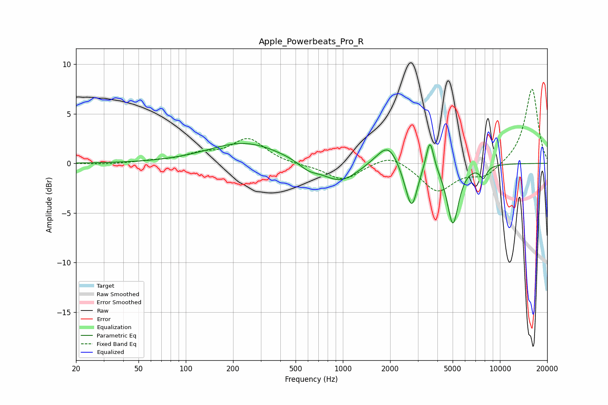

# Apple_Powerbeats_Pro_R
See [usage instructions](https://github.com/jaakkopasanen/AutoEq#usage) for more options and info.

### Parametric EQs
Apply preamp of -2.1 dB when using parametric equalizer.

|   # | Type    |   Fc (Hz) |    Q |   Gain (dB) |
|-----|---------|-----------|------|-------------|
|   1 | Peaking |       237 | 0.62 |         2.1 |
|   2 | Peaking |       604 | 2.24 |        -0.7 |
|   3 | Peaking |       960 | 1.23 |        -2   |
|   4 | Peaking |      1712 | 1.67 |         0.5 |
|   5 | Peaking |      1957 | 2.27 |         1.9 |
|   6 | Peaking |      2552 | 3.07 |        -0.9 |
|   7 | Peaking |      2751 | 4.06 |        -3.9 |
|   8 | Peaking |      3583 | 5.88 |         3.3 |
|   9 | Peaking |      5018 | 3.82 |        -6.1 |
|  10 | Peaking |      7843 | 6    |        -1.2 |

### Fixed Band EQs
When using fixed band (also called graphic) equalizer, apply preamp of **-7.6 dB** (if available) and set gains manually with these parameters.

|   # | Type    |   Fc (Hz) |    Q |   Gain (dB) |
|-----|---------|-----------|------|-------------|
|   1 | Peaking |        31 | 1.41 |        -0.1 |
|   2 | Peaking |        62 | 1.41 |         0.2 |
|   3 | Peaking |       125 | 1.41 |         0.8 |
|   4 | Peaking |       250 | 1.41 |         2.4 |
|   5 | Peaking |       500 | 1.41 |        -0.2 |
|   6 | Peaking |      1000 | 1.41 |        -1.7 |
|   7 | Peaking |      2000 | 1.41 |         1.1 |
|   8 | Peaking |      4000 | 1.41 |        -2.8 |
|   9 | Peaking |      8000 | 1.41 |        -1.3 |
|  10 | Peaking |     16000 | 1.41 |         7.6 |

### Graphs

