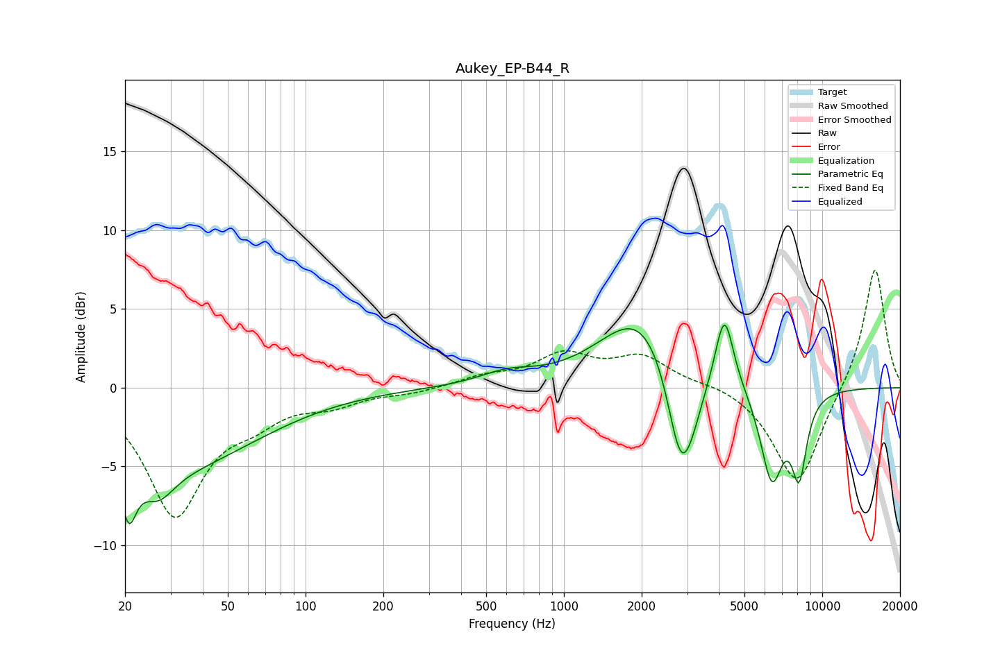

# Aukey_EP-B44_R
See [usage instructions](https://github.com/jaakkopasanen/AutoEq#usage) for more options and info.

### Parametric EQs
Apply preamp of -4.1 dB when using parametric equalizer.

|   # | Type    |   Fc (Hz) |    Q |   Gain (dB) |
|-----|---------|-----------|------|-------------|
|   1 | Peaking |        21 | 4.86 |        -3.5 |
|   2 | Peaking |        27 | 2.2  |        -2   |
|   3 | Peaking |        31 | 0.43 |        -4.8 |
|   4 | Peaking |       602 | 1.32 |         0.7 |
|   5 | Peaking |      2011 | 0.9  |         4.9 |
|   6 | Peaking |      2824 | 2.66 |        -6.1 |
|   7 | Peaking |      3088 | 2.62 |        -1.9 |
|   8 | Peaking |      4181 | 4.01 |         4.7 |
|   9 | Peaking |      6378 | 3.02 |        -5.9 |
|  10 | Peaking |      8141 | 4.5  |        -4.9 |

### Fixed Band EQs
When using fixed band (also called graphic) equalizer, apply preamp of **-7.6 dB** (if available) and set gains manually with these parameters.

|   # | Type    |   Fc (Hz) |    Q |   Gain (dB) |
|-----|---------|-----------|------|-------------|
|   1 | Peaking |        31 | 1.41 |        -7.9 |
|   2 | Peaking |        62 | 1.41 |        -1.5 |
|   3 | Peaking |       125 | 1.41 |        -0.9 |
|   4 | Peaking |       250 | 1.41 |        -0.3 |
|   5 | Peaking |       500 | 1.41 |         0.6 |
|   6 | Peaking |      1000 | 1.41 |         1.9 |
|   7 | Peaking |      2000 | 1.41 |         1.8 |
|   8 | Peaking |      4000 | 1.41 |         0.3 |
|   9 | Peaking |      8000 | 1.41 |        -6.3 |
|  10 | Peaking |     16000 | 1.41 |         7.8 |

### Graphs

