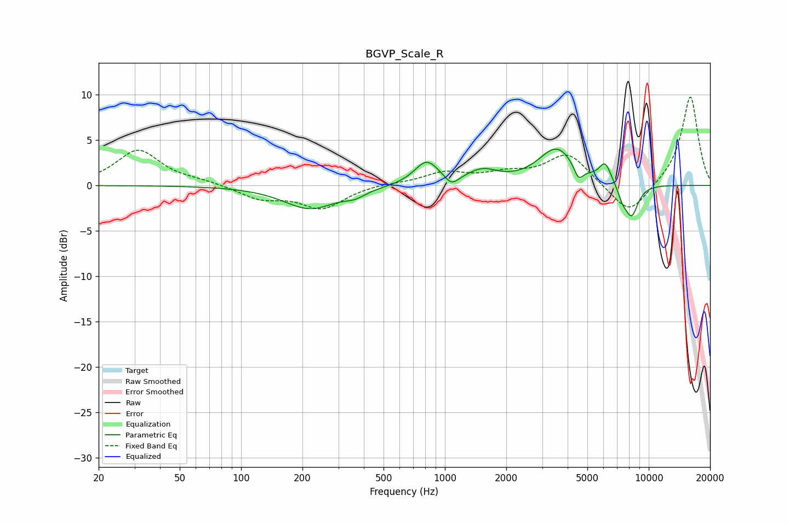

# BGVP_Scale_R
See [usage instructions](https://github.com/jaakkopasanen/AutoEq#usage) for more options and info.

### Parametric EQs
Apply preamp of -4.1 dB when using parametric equalizer.

|   # | Type    |   Fc (Hz) |    Q |   Gain (dB) |
|-----|---------|-----------|------|-------------|
|   1 | Peaking |       218 | 1.09 |        -2.5 |
|   2 | Peaking |       361 | 2.83 |        -0.6 |
|   3 | Peaking |       814 | 2.37 |         2.6 |
|   4 | Peaking |      1078 | 4.24 |        -1.1 |
|   5 | Peaking |      1525 | 1.89 |         1.4 |
|   6 | Peaking |      3541 | 1.57 |         4   |
|   7 | Peaking |      4528 | 5.99 |        -1.6 |
|   8 | Peaking |      6115 | 4.7  |         2.1 |
|   9 | Peaking |      7426 | 6    |        -1.1 |
|  10 | Peaking |      8229 | 3.93 |        -3.5 |

### Fixed Band EQs
When using fixed band (also called graphic) equalizer, apply preamp of **-9.8 dB** (if available) and set gains manually with these parameters.

|   # | Type    |   Fc (Hz) |    Q |   Gain (dB) |
|-----|---------|-----------|------|-------------|
|   1 | Peaking |        31 | 1.41 |         3.9 |
|   2 | Peaking |        62 | 1.41 |         0.4 |
|   3 | Peaking |       125 | 1.41 |        -1.4 |
|   4 | Peaking |       250 | 1.41 |        -2.5 |
|   5 | Peaking |       500 | 1.41 |         0.2 |
|   6 | Peaking |      1000 | 1.41 |         1.3 |
|   7 | Peaking |      2000 | 1.41 |         1.1 |
|   8 | Peaking |      4000 | 1.41 |         3.5 |
|   9 | Peaking |      8000 | 1.41 |        -3.5 |
|  10 | Peaking |     16000 | 1.41 |         9.9 |

### Graphs

