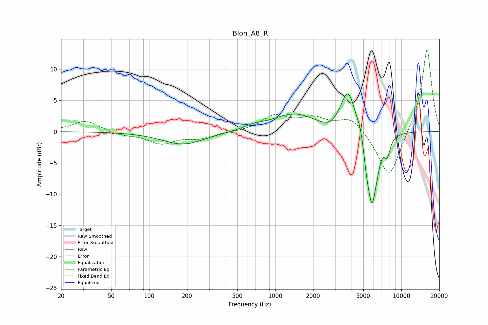

# Blon_A8_R
See [usage instructions](https://github.com/jaakkopasanen/AutoEq#usage) for more options and info.

### Parametric EQs
Apply preamp of -6.1 dB when using parametric equalizer.

|   # | Type    |   Fc (Hz) |    Q |   Gain (dB) |
|-----|---------|-----------|------|-------------|
|   1 | Peaking |       186 | 0.84 |        -2.1 |
|   2 | Peaking |       682 | 1.79 |         0.6 |
|   3 | Peaking |      1410 | 0.84 |         2.8 |
|   4 | Peaking |      2737 | 1.86 |        -1.1 |
|   5 | Peaking |      3786 | 2.33 |         6.9 |
|   6 | Peaking |      4743 | 6    |         1   |
|   7 | Peaking |      5311 | 5.99 |        -2.6 |
|   8 | Peaking |      5861 | 3.7  |       -11.2 |
|   9 | Peaking |      6433 | 6    |        -1.3 |
|  10 | Peaking |      7737 | 5.53 |        -2.7 |

### Fixed Band EQs
When using fixed band (also called graphic) equalizer, apply preamp of **-13.1 dB** (if available) and set gains manually with these parameters.

|   # | Type    |   Fc (Hz) |    Q |   Gain (dB) |
|-----|---------|-----------|------|-------------|
|   1 | Peaking |        31 | 1.41 |         1.8 |
|   2 | Peaking |        62 | 1.41 |        -0.6 |
|   3 | Peaking |       125 | 1.41 |        -1.8 |
|   4 | Peaking |       250 | 1.41 |        -1   |
|   5 | Peaking |       500 | 1.41 |        -0.1 |
|   6 | Peaking |      1000 | 1.41 |         2.4 |
|   7 | Peaking |      2000 | 1.41 |         1.9 |
|   8 | Peaking |      4000 | 1.41 |         2.4 |
|   9 | Peaking |      8000 | 1.41 |        -7.8 |
|  10 | Peaking |     16000 | 1.41 |        13.5 |

### Graphs

