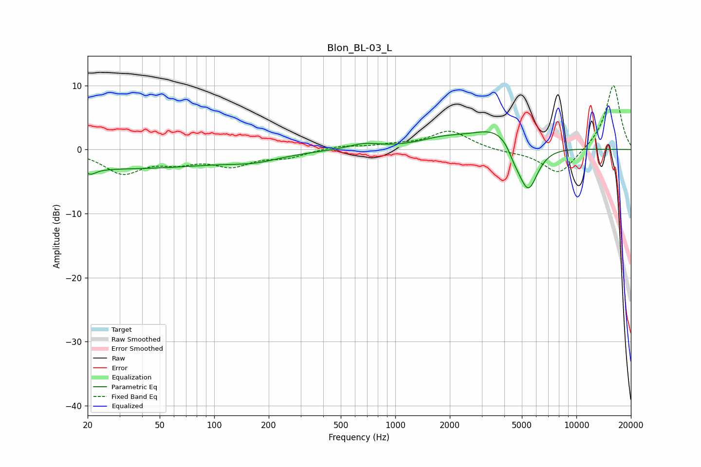

# Blon_BL-03_L
See [usage instructions](https://github.com/jaakkopasanen/AutoEq#usage) for more options and info.

### Parametric EQs
Apply preamp of -2.9 dB when using parametric equalizer.

|   # | Type    |   Fc (Hz) |    Q |   Gain (dB) |
|-----|---------|-----------|------|-------------|
|   1 | Peaking |        20 | 5.4  |         2   |
|   2 | Peaking |        20 | 4.71 |        -2.8 |
|   3 | Peaking |        27 | 0.2  |        -3   |
|   4 | Peaking |       169 | 1.02 |        -0.9 |
|   5 | Peaking |       672 | 1.69 |         0.9 |
|   6 | Peaking |      1812 | 1.08 |         1.2 |
|   7 | Peaking |      3861 | 0.95 |         4   |
|   8 | Peaking |      4492 | 5.07 |        -0.9 |
|   9 | Peaking |      4867 | 2.5  |        -1.7 |
|  10 | Peaking |      5441 | 2.46 |        -7.3 |

### Fixed Band EQs
When using fixed band (also called graphic) equalizer, apply preamp of **-10.1 dB** (if available) and set gains manually with these parameters.

|   # | Type    |   Fc (Hz) |    Q |   Gain (dB) |
|-----|---------|-----------|------|-------------|
|   1 | Peaking |        31 | 1.41 |        -3.5 |
|   2 | Peaking |        62 | 1.41 |        -1.6 |
|   3 | Peaking |       125 | 1.41 |        -2.3 |
|   4 | Peaking |       250 | 1.41 |        -1.1 |
|   5 | Peaking |       500 | 1.41 |         0.6 |
|   6 | Peaking |      1000 | 1.41 |         0.6 |
|   7 | Peaking |      2000 | 1.41 |         2.9 |
|   8 | Peaking |      4000 | 1.41 |        -0.3 |
|   9 | Peaking |      8000 | 1.41 |        -4.1 |
|  10 | Peaking |     16000 | 1.41 |        10.2 |

### Graphs

