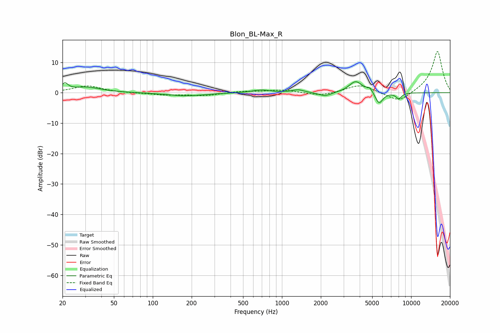

# Blon_BL-Max_R
See [usage instructions](https://github.com/jaakkopasanen/AutoEq#usage) for more options and info.

### Parametric EQs
Apply preamp of -3.7 dB when using parametric equalizer.

|   # | Type    |   Fc (Hz) |    Q |   Gain (dB) |
|-----|---------|-----------|------|-------------|
|   1 | Peaking |        21 | 5.94 |         2.3 |
|   2 | Peaking |        30 | 1.22 |         1.8 |
|   3 | Peaking |       179 | 1    |        -1.1 |
|   4 | Peaking |       688 | 2.18 |         0.9 |
|   5 | Peaking |      1336 | 3.13 |         1   |
|   6 | Peaking |      2156 | 2.86 |        -1.3 |
|   7 | Peaking |      3725 | 2.76 |         3.8 |
|   8 | Peaking |      4790 | 5.99 |         1.5 |
|   9 | Peaking |      5646 | 4.57 |        -3.9 |
|  10 | Peaking |      8020 | 6    |        -1.9 |

### Fixed Band EQs
When using fixed band (also called graphic) equalizer, apply preamp of **-13.6 dB** (if available) and set gains manually with these parameters.

|   # | Type    |   Fc (Hz) |    Q |   Gain (dB) |
|-----|---------|-----------|------|-------------|
|   1 | Peaking |        31 | 1.41 |         2.3 |
|   2 | Peaking |        62 | 1.41 |        -0.1 |
|   3 | Peaking |       125 | 1.41 |        -0.7 |
|   4 | Peaking |       250 | 1.41 |        -1   |
|   5 | Peaking |       500 | 1.41 |         0.5 |
|   6 | Peaking |      1000 | 1.41 |         0.9 |
|   7 | Peaking |      2000 | 1.41 |        -1.1 |
|   8 | Peaking |      4000 | 1.41 |         2.7 |
|   9 | Peaking |      8000 | 1.41 |        -3.4 |
|  10 | Peaking |     16000 | 1.41 |        13.8 |

### Graphs

