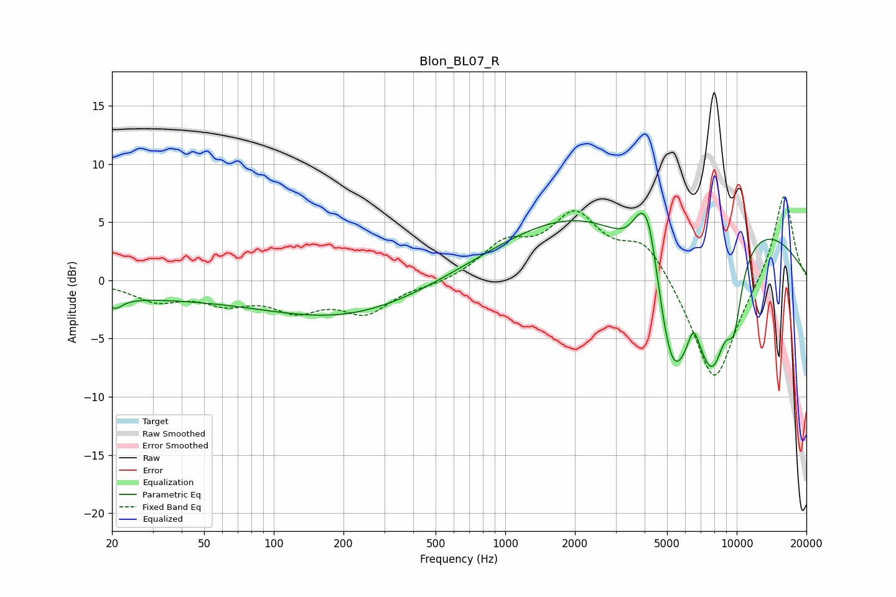

# Blon_BL07_R
See [usage instructions](https://github.com/jaakkopasanen/AutoEq#usage) for more options and info.

### Parametric EQs
Apply preamp of -5.9 dB when using parametric equalizer.

|   # | Type    |   Fc (Hz) |    Q |   Gain (dB) |
|-----|---------|-----------|------|-------------|
|   1 | Peaking |        20 | 0.21 |        -1.3 |
|   2 | Peaking |        21 | 4.33 |        -0.9 |
|   3 | Peaking |       204 | 0.41 |        -3   |
|   4 | Peaking |      3787 | 3.65 |         1.4 |
|   5 | Peaking |      4169 | 2.85 |         6.8 |
|   6 | Peaking |      4983 | 0.21 |         9.7 |
|   7 | Peaking |      5259 | 1.17 |       -16.6 |
|   8 | Peaking |      6504 | 5.54 |         2.2 |
|   9 | Peaking |      7888 | 1.89 |        -8.8 |
|  10 | Peaking |      9749 | 3.9  |        -4.6 |

### Fixed Band EQs
When using fixed band (also called graphic) equalizer, apply preamp of **-7.3 dB** (if available) and set gains manually with these parameters.

|   # | Type    |   Fc (Hz) |    Q |   Gain (dB) |
|-----|---------|-----------|------|-------------|
|   1 | Peaking |        31 | 1.41 |        -1.6 |
|   2 | Peaking |        62 | 1.41 |        -1.6 |
|   3 | Peaking |       125 | 1.41 |        -2.2 |
|   4 | Peaking |       250 | 1.41 |        -2.6 |
|   5 | Peaking |       500 | 1.41 |        -0.4 |
|   6 | Peaking |      1000 | 1.41 |         2.8 |
|   7 | Peaking |      2000 | 1.41 |         5.2 |
|   8 | Peaking |      4000 | 1.41 |         3.4 |
|   9 | Peaking |      8000 | 1.41 |        -9.2 |
|  10 | Peaking |     16000 | 1.41 |         7.7 |

### Graphs

