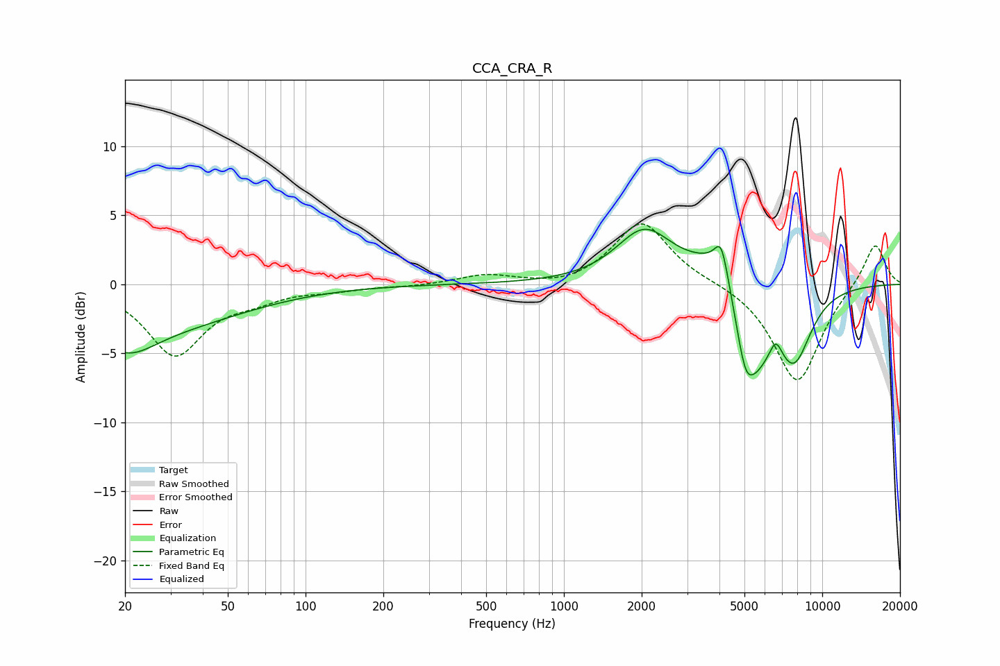

# CCA_CRA_R
See [usage instructions](https://github.com/jaakkopasanen/AutoEq#usage) for more options and info.

### Parametric EQs
Apply preamp of -4.1 dB when using parametric equalizer.

|   # | Type    |   Fc (Hz) |    Q |   Gain (dB) |
|-----|---------|-----------|------|-------------|
|   1 | Peaking |        20 | 1.22 |        -2.7 |
|   2 | Peaking |        30 | 0.45 |        -2.6 |
|   3 | Peaking |      2045 | 1.31 |         3.7 |
|   4 | Peaking |      4060 | 5.97 |         2   |
|   5 | Peaking |      4577 | 1.36 |         5.3 |
|   6 | Peaking |      4653 | 3.26 |        -1.6 |
|   7 | Peaking |      5034 | 4.29 |        -3   |
|   8 | Peaking |      5481 | 1.84 |        -7.3 |
|   9 | Peaking |      6615 | 5.98 |         1.2 |
|  10 | Peaking |      7792 | 1.94 |        -4.9 |

### Fixed Band EQs
When using fixed band (also called graphic) equalizer, apply preamp of **-4.5 dB** (if available) and set gains manually with these parameters.

|   # | Type    |   Fc (Hz) |    Q |   Gain (dB) |
|-----|---------|-----------|------|-------------|
|   1 | Peaking |        31 | 1.41 |        -5   |
|   2 | Peaking |        62 | 1.41 |        -0.8 |
|   3 | Peaking |       125 | 1.41 |        -0.3 |
|   4 | Peaking |       250 | 1.41 |        -0.1 |
|   5 | Peaking |       500 | 1.41 |         0.7 |
|   6 | Peaking |      1000 | 1.41 |        -0.3 |
|   7 | Peaking |      2000 | 1.41 |         4.6 |
|   8 | Peaking |      4000 | 1.41 |         0.2 |
|   9 | Peaking |      8000 | 1.41 |        -7.2 |
|  10 | Peaking |     16000 | 1.41 |         3.2 |

### Graphs

