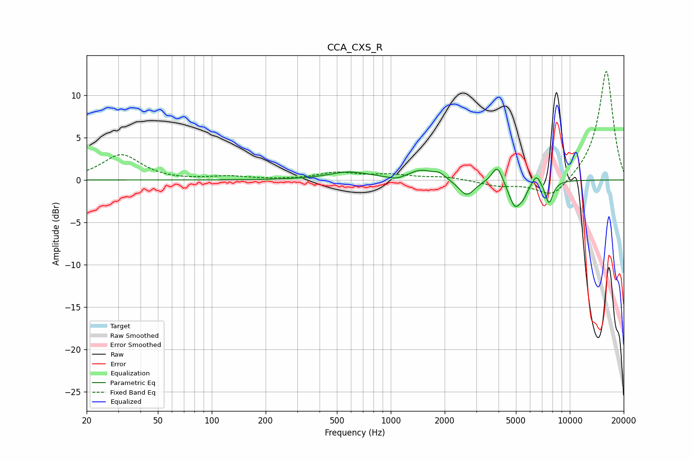

# CCA_CXS_R
See [usage instructions](https://github.com/jaakkopasanen/AutoEq#usage) for more options and info.

### Parametric EQs
Apply preamp of -1.4 dB when using parametric equalizer.

|   # | Type    |   Fc (Hz) |    Q |   Gain (dB) |
|-----|---------|-----------|------|-------------|
|   1 | Peaking |       586 | 1.24 |         0.9 |
|   2 | Peaking |      1074 | 3.24 |        -0.4 |
|   3 | Peaking |      1478 | 2.08 |         1.1 |
|   4 | Peaking |      1872 | 4.52 |         0.6 |
|   5 | Peaking |      2654 | 3.21 |        -1.9 |
|   6 | Peaking |      3938 | 4.77 |         2.1 |
|   7 | Peaking |      4940 | 3.92 |        -3.1 |
|   8 | Peaking |      5506 | 6    |        -0.9 |
|   9 | Peaking |      6516 | 6    |         1.2 |
|  10 | Peaking |      7654 | 5.94 |        -2.7 |

### Fixed Band EQs
When using fixed band (also called graphic) equalizer, apply preamp of **-12.9 dB** (if available) and set gains manually with these parameters.

|   # | Type    |   Fc (Hz) |    Q |   Gain (dB) |
|-----|---------|-----------|------|-------------|
|   1 | Peaking |        31 | 1.41 |         3   |
|   2 | Peaking |        62 | 1.41 |        -0.1 |
|   3 | Peaking |       125 | 1.41 |         0.4 |
|   4 | Peaking |       250 | 1.41 |        -0   |
|   5 | Peaking |       500 | 1.41 |         0.8 |
|   6 | Peaking |      1000 | 1.41 |         0.5 |
|   7 | Peaking |      2000 | 1.41 |         0.3 |
|   8 | Peaking |      4000 | 1.41 |        -0.7 |
|   9 | Peaking |      8000 | 1.41 |        -2.3 |
|  10 | Peaking |     16000 | 1.41 |        13   |

### Graphs

