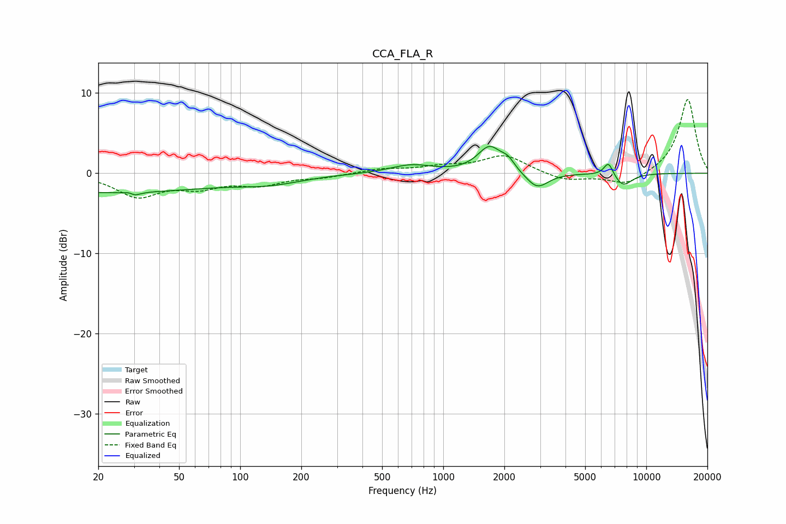

# CCA_FLA_R
See [usage instructions](https://github.com/jaakkopasanen/AutoEq#usage) for more options and info.

### Parametric EQs
Apply preamp of -3.4 dB when using parametric equalizer.

|   # | Type    |   Fc (Hz) |    Q |   Gain (dB) |
|-----|---------|-----------|------|-------------|
|   1 | Peaking |        20 | 0.22 |        -2.4 |
|   2 | Peaking |        29 | 5.55 |         2.3 |
|   3 | Peaking |        29 | 5.24 |        -2.5 |
|   4 | Peaking |       142 | 0.92 |        -0.9 |
|   5 | Peaking |       696 | 1.38 |         1   |
|   6 | Peaking |      1690 | 2.44 |         3.2 |
|   7 | Peaking |      2082 | 4.29 |         1.1 |
|   8 | Peaking |      2899 | 2.58 |        -2.1 |
|   9 | Peaking |      6517 | 5.92 |         1.8 |
|  10 | Peaking |      7694 | 3.02 |        -1.6 |

### Fixed Band EQs
When using fixed band (also called graphic) equalizer, apply preamp of **-9.3 dB** (if available) and set gains manually with these parameters.

|   # | Type    |   Fc (Hz) |    Q |   Gain (dB) |
|-----|---------|-----------|------|-------------|
|   1 | Peaking |        31 | 1.41 |        -2.8 |
|   2 | Peaking |        62 | 1.41 |        -1.5 |
|   3 | Peaking |       125 | 1.41 |        -1.3 |
|   4 | Peaking |       250 | 1.41 |        -0.5 |
|   5 | Peaking |       500 | 1.41 |         0.5 |
|   6 | Peaking |      1000 | 1.41 |         0.7 |
|   7 | Peaking |      2000 | 1.41 |         2.2 |
|   8 | Peaking |      4000 | 1.41 |        -1   |
|   9 | Peaking |      8000 | 1.41 |        -1.5 |
|  10 | Peaking |     16000 | 1.41 |         9.3 |

### Graphs

