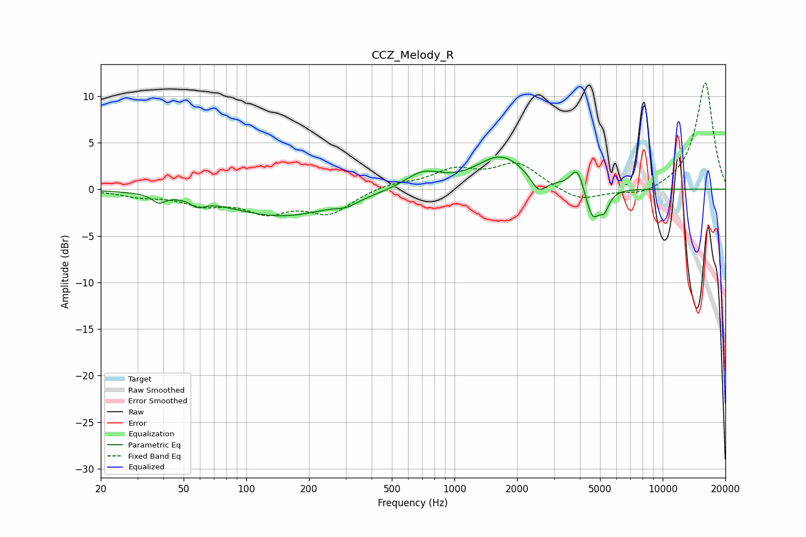

# CCZ_Melody_R
See [usage instructions](https://github.com/jaakkopasanen/AutoEq#usage) for more options and info.

### Parametric EQs
Apply preamp of -3.6 dB when using parametric equalizer.

|   # | Type    |   Fc (Hz) |    Q |   Gain (dB) |
|-----|---------|-----------|------|-------------|
|   1 | Peaking |        38 | 4.69 |        -0.9 |
|   2 | Peaking |        59 | 4.27 |        -0.8 |
|   3 | Peaking |       148 | 0.56 |        -2.9 |
|   4 | Peaking |       303 | 2.8  |        -0.6 |
|   5 | Peaking |       704 | 1.61 |         1.8 |
|   6 | Peaking |      1675 | 1.21 |         3.5 |
|   7 | Peaking |      2536 | 4    |        -1.7 |
|   8 | Peaking |      3890 | 4.55 |         2.5 |
|   9 | Peaking |      4602 | 4.17 |        -3.4 |
|  10 | Peaking |      5247 | 6    |        -1.7 |

### Fixed Band EQs
When using fixed band (also called graphic) equalizer, apply preamp of **-11.5 dB** (if available) and set gains manually with these parameters.

|   # | Type    |   Fc (Hz) |    Q |   Gain (dB) |
|-----|---------|-----------|------|-------------|
|   1 | Peaking |        31 | 1.41 |        -0.6 |
|   2 | Peaking |        62 | 1.41 |        -1.4 |
|   3 | Peaking |       125 | 1.41 |        -2.2 |
|   4 | Peaking |       250 | 1.41 |        -2.5 |
|   5 | Peaking |       500 | 1.41 |         0.6 |
|   6 | Peaking |      1000 | 1.41 |         1.9 |
|   7 | Peaking |      2000 | 1.41 |         2.7 |
|   8 | Peaking |      4000 | 1.41 |        -1.4 |
|   9 | Peaking |      8000 | 1.41 |        -0.8 |
|  10 | Peaking |     16000 | 1.41 |        11.5 |

### Graphs

