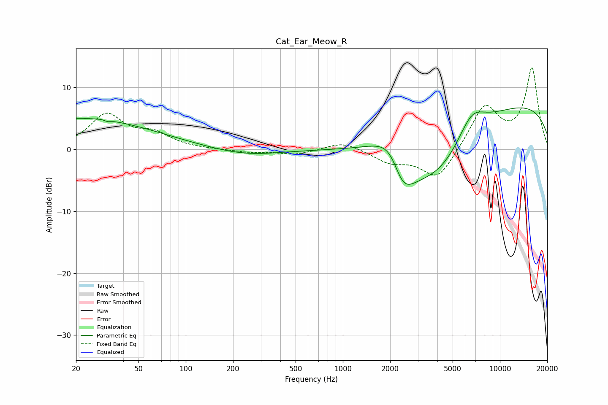

# Cat_Ear_Meow_R
See [usage instructions](https://github.com/jaakkopasanen/AutoEq#usage) for more options and info.

### Parametric EQs
Apply preamp of -6.8 dB when using parametric equalizer.

|   # | Type    |   Fc (Hz) |    Q |   Gain (dB) |
|-----|---------|-----------|------|-------------|
|   1 | Peaking |        20 | 0.29 |         4.9 |
|   2 | Peaking |        31 | 5.36 |         1.5 |
|   3 | Peaking |        31 | 5.84 |        -1.7 |
|   4 | Peaking |       122 | 0.2  |         0.3 |
|   5 | Peaking |       240 | 0.64 |        -1.2 |
|   6 | Peaking |      2096 | 0.86 |        15.5 |
|   7 | Peaking |      2375 | 0.89 |       -19.1 |
|   8 | Peaking |      4121 | 0.65 |        -7.4 |
|   9 | Peaking |      6597 | 1.53 |         4.4 |
|  10 | Peaking |      9999 | 0.2  |         7.9 |

### Fixed Band EQs
When using fixed band (also called graphic) equalizer, apply preamp of **-13.3 dB** (if available) and set gains manually with these parameters.

|   # | Type    |   Fc (Hz) |    Q |   Gain (dB) |
|-----|---------|-----------|------|-------------|
|   1 | Peaking |        31 | 1.41 |         5.4 |
|   2 | Peaking |        62 | 1.41 |         2.2 |
|   3 | Peaking |       125 | 1.41 |        -0   |
|   4 | Peaking |       250 | 1.41 |        -0.5 |
|   5 | Peaking |       500 | 1.41 |        -0.8 |
|   6 | Peaking |      1000 | 1.41 |         1.3 |
|   7 | Peaking |      2000 | 1.41 |        -1.9 |
|   8 | Peaking |      4000 | 1.41 |        -5   |
|   9 | Peaking |      8000 | 1.41 |         7   |
|  10 | Peaking |     16000 | 1.41 |        13   |

### Graphs

