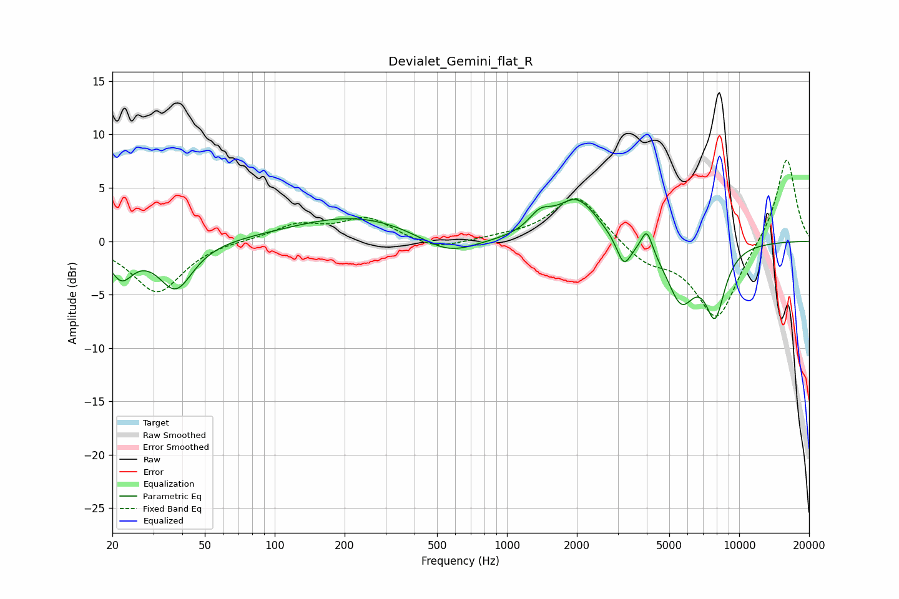

# Devialet_Gemini_flat_R
See [usage instructions](https://github.com/jaakkopasanen/AutoEq#usage) for more options and info.

### Parametric EQs
Apply preamp of -4.0 dB when using parametric equalizer.

|   # | Type    |   Fc (Hz) |    Q |   Gain (dB) |
|-----|---------|-----------|------|-------------|
|   1 | Peaking |        22 | 2.8  |        -3   |
|   2 | Peaking |        38 | 1.93 |        -4.4 |
|   3 | Peaking |       225 | 0.52 |         2.4 |
|   4 | Peaking |       558 | 1.14 |        -1.9 |
|   5 | Peaking |      1387 | 2.85 |         1.6 |
|   6 | Peaking |      2005 | 1.58 |         3.9 |
|   7 | Peaking |      3187 | 4.47 |        -2.6 |
|   8 | Peaking |      4003 | 5.99 |         2.2 |
|   9 | Peaking |      5619 | 2.21 |        -5.3 |
|  10 | Peaking |      7877 | 3.08 |        -6.1 |

### Fixed Band EQs
When using fixed band (also called graphic) equalizer, apply preamp of **-7.7 dB** (if available) and set gains manually with these parameters.

|   # | Type    |   Fc (Hz) |    Q |   Gain (dB) |
|-----|---------|-----------|------|-------------|
|   1 | Peaking |        31 | 1.41 |        -4.8 |
|   2 | Peaking |        62 | 1.41 |         0.1 |
|   3 | Peaking |       125 | 1.41 |         1.5 |
|   4 | Peaking |       250 | 1.41 |         2.1 |
|   5 | Peaking |       500 | 1.41 |        -0.9 |
|   6 | Peaking |      1000 | 1.41 |         0.3 |
|   7 | Peaking |      2000 | 1.41 |         4.4 |
|   8 | Peaking |      4000 | 1.41 |        -1.8 |
|   9 | Peaking |      8000 | 1.41 |        -7.3 |
|  10 | Peaking |     16000 | 1.41 |         8   |

### Graphs

