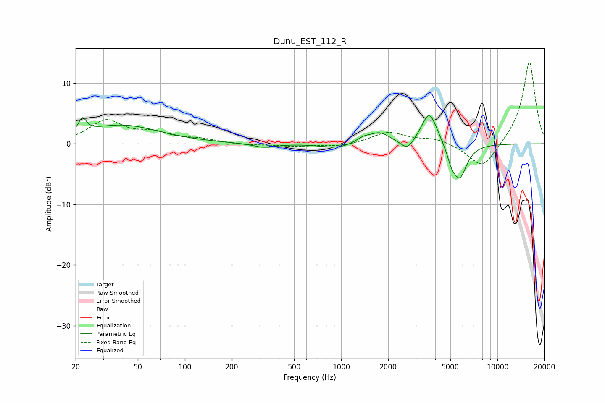

# Dunu_EST_112_R
See [usage instructions](https://github.com/jaakkopasanen/AutoEq#usage) for more options and info.

### Parametric EQs
Apply preamp of -4.7 dB when using parametric equalizer.

|   # | Type    |   Fc (Hz) |    Q |   Gain (dB) |
|-----|---------|-----------|------|-------------|
|   1 | Peaking |        22 | 5.91 |         2.3 |
|   2 | Peaking |        39 | 0.59 |         3   |
|   3 | Peaking |       323 | 2    |        -0.7 |
|   4 | Peaking |       938 | 1.46 |        -0.8 |
|   5 | Peaking |      1383 | 3.22 |         0.8 |
|   6 | Peaking |      1762 | 2.2  |         1.7 |
|   7 | Peaking |      2656 | 3.39 |        -1.8 |
|   8 | Peaking |      3665 | 2.79 |         5.5 |
|   9 | Peaking |      5073 | 5.1  |        -1.9 |
|  10 | Peaking |      5733 | 3.05 |        -5.6 |

### Fixed Band EQs
When using fixed band (also called graphic) equalizer, apply preamp of **-13.5 dB** (if available) and set gains manually with these parameters.

|   # | Type    |   Fc (Hz) |    Q |   Gain (dB) |
|-----|---------|-----------|------|-------------|
|   1 | Peaking |        31 | 1.41 |         3.7 |
|   2 | Peaking |        62 | 1.41 |         1.5 |
|   3 | Peaking |       125 | 1.41 |         0.7 |
|   4 | Peaking |       250 | 1.41 |        -0.2 |
|   5 | Peaking |       500 | 1.41 |        -0.4 |
|   6 | Peaking |      1000 | 1.41 |        -0.5 |
|   7 | Peaking |      2000 | 1.41 |         1.9 |
|   8 | Peaking |      4000 | 1.41 |         0.9 |
|   9 | Peaking |      8000 | 1.41 |        -4.4 |
|  10 | Peaking |     16000 | 1.41 |        13.8 |

### Graphs

