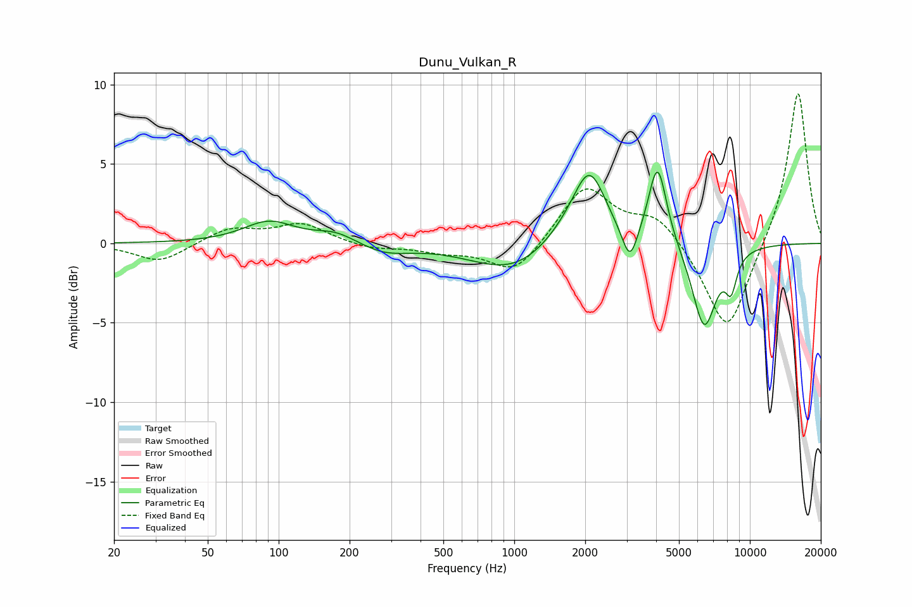

# Dunu_Vulkan_R
See [usage instructions](https://github.com/jaakkopasanen/AutoEq#usage) for more options and info.

### Parametric EQs
Apply preamp of -4.6 dB when using parametric equalizer.

|   # | Type    |   Fc (Hz) |    Q |   Gain (dB) |
|-----|---------|-----------|------|-------------|
|   1 | Peaking |        91 | 1.3  |         1.4 |
|   2 | Peaking |       175 | 1.59 |         0.7 |
|   3 | Peaking |       281 | 1.36 |        -0.6 |
|   4 | Peaking |       988 | 0.81 |        -1.8 |
|   5 | Peaking |      1694 | 1.32 |         0.9 |
|   6 | Peaking |      2087 | 2.05 |         4.3 |
|   7 | Peaking |      3096 | 4.28 |        -2.3 |
|   8 | Peaking |      4058 | 3.61 |         5.1 |
|   9 | Peaking |      6395 | 2.63 |        -5.3 |
|  10 | Peaking |      8322 | 5.38 |        -2.1 |

### Fixed Band EQs
When using fixed band (also called graphic) equalizer, apply preamp of **-9.5 dB** (if available) and set gains manually with these parameters.

|   # | Type    |   Fc (Hz) |    Q |   Gain (dB) |
|-----|---------|-----------|------|-------------|
|   1 | Peaking |        31 | 1.41 |        -1.2 |
|   2 | Peaking |        62 | 1.41 |         0.9 |
|   3 | Peaking |       125 | 1.41 |         1.2 |
|   4 | Peaking |       250 | 1.41 |        -0.4 |
|   5 | Peaking |       500 | 1.41 |        -0.5 |
|   6 | Peaking |      1000 | 1.41 |        -2   |
|   7 | Peaking |      2000 | 1.41 |         3.6 |
|   8 | Peaking |      4000 | 1.41 |         1.7 |
|   9 | Peaking |      8000 | 1.41 |        -5.8 |
|  10 | Peaking |     16000 | 1.41 |         9.8 |

### Graphs

