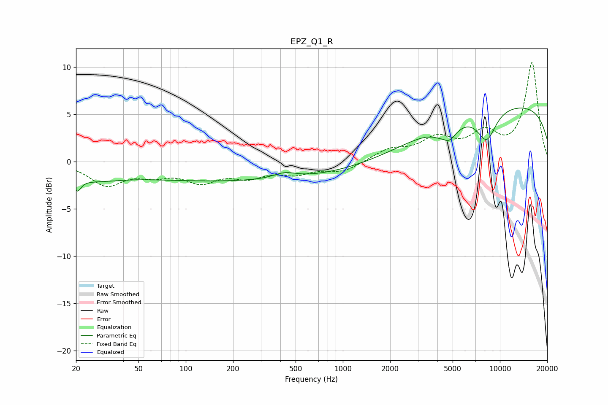

# EPZ_Q1_R
See [usage instructions](https://github.com/jaakkopasanen/AutoEq#usage) for more options and info.

### Parametric EQs
Apply preamp of -5.7 dB when using parametric equalizer.

|   # | Type    |   Fc (Hz) |    Q |   Gain (dB) |
|-----|---------|-----------|------|-------------|
|   1 | Peaking |        20 | 5.71 |        -1.5 |
|   2 | Peaking |        24 | 4.71 |        -0   |
|   3 | Peaking |        25 | 0.83 |        -1.3 |
|   4 | Peaking |       197 | 0.18 |        -2.1 |
|   5 | Peaking |       426 | 1.93 |         0.6 |
|   6 | Peaking |      4409 | 4.48 |         0.6 |
|   7 | Peaking |      4581 | 2.56 |        -2.3 |
|   8 | Peaking |      6582 | 0.19 |        -4.1 |
|   9 | Peaking |      8234 | 2.2  |        -3.2 |
|  10 | Peaking |      9516 | 0.2  |         9.8 |

### Fixed Band EQs
When using fixed band (also called graphic) equalizer, apply preamp of **-10.5 dB** (if available) and set gains manually with these parameters.

|   # | Type    |   Fc (Hz) |    Q |   Gain (dB) |
|-----|---------|-----------|------|-------------|
|   1 | Peaking |        31 | 1.41 |        -2.4 |
|   2 | Peaking |        62 | 1.41 |        -1.1 |
|   3 | Peaking |       125 | 1.41 |        -1.9 |
|   4 | Peaking |       250 | 1.41 |        -1.4 |
|   5 | Peaking |       500 | 1.41 |        -1.1 |
|   6 | Peaking |      1000 | 1.41 |        -1   |
|   7 | Peaking |      2000 | 1.41 |         1.2 |
|   8 | Peaking |      4000 | 1.41 |         2.2 |
|   9 | Peaking |      8000 | 1.41 |         2.6 |
|  10 | Peaking |     16000 | 1.41 |        10.4 |

### Graphs

