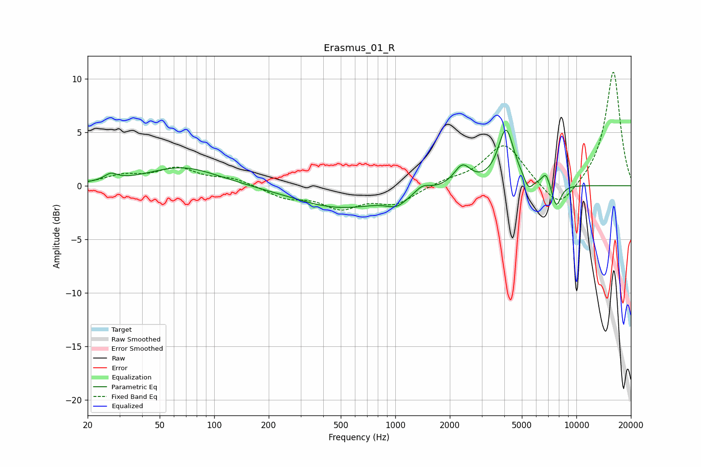

# Erasmus_01_R
See [usage instructions](https://github.com/jaakkopasanen/AutoEq#usage) for more options and info.

### Parametric EQs
Apply preamp of -5.3 dB when using parametric equalizer.

|   # | Type    |   Fc (Hz) |    Q |   Gain (dB) |
|-----|---------|-----------|------|-------------|
|   1 | Peaking |        27 | 3.99 |         0.6 |
|   2 | Peaking |        67 | 0.73 |         1.8 |
|   3 | Peaking |       498 | 0.56 |        -2.1 |
|   4 | Peaking |      1019 | 2.46 |        -0.9 |
|   5 | Peaking |      1413 | 3.56 |         0.7 |
|   6 | Peaking |      2347 | 3.09 |         1.9 |
|   7 | Peaking |      4089 | 3.23 |         5.2 |
|   8 | Peaking |      5446 | 5.93 |        -1.1 |
|   9 | Peaking |      6793 | 5.99 |         1.3 |
|  10 | Peaking |      7746 | 5.15 |        -2.2 |

### Fixed Band EQs
When using fixed band (also called graphic) equalizer, apply preamp of **-10.7 dB** (if available) and set gains manually with these parameters.

|   # | Type    |   Fc (Hz) |    Q |   Gain (dB) |
|-----|---------|-----------|------|-------------|
|   1 | Peaking |        31 | 1.41 |         0.8 |
|   2 | Peaking |        62 | 1.41 |         1.5 |
|   3 | Peaking |       125 | 1.41 |         0.6 |
|   4 | Peaking |       250 | 1.41 |        -1   |
|   5 | Peaking |       500 | 1.41 |        -1.9 |
|   6 | Peaking |      1000 | 1.41 |        -1.6 |
|   7 | Peaking |      2000 | 1.41 |         0.4 |
|   8 | Peaking |      4000 | 1.41 |         3.9 |
|   9 | Peaking |      8000 | 1.41 |        -2.5 |
|  10 | Peaking |     16000 | 1.41 |        10.8 |

### Graphs

