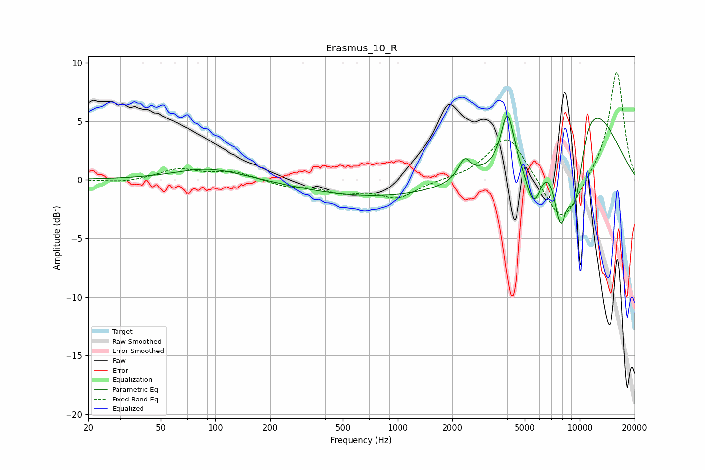

# Erasmus_10_R
See [usage instructions](https://github.com/jaakkopasanen/AutoEq#usage) for more options and info.

### Parametric EQs
Apply preamp of -5.5 dB when using parametric equalizer.

|   # | Type    |   Fc (Hz) |    Q |   Gain (dB) |
|-----|---------|-----------|------|-------------|
|   1 | Peaking |       101 | 0.79 |         1.9 |
|   2 | Peaking |       108 | 0.9  |        -0.9 |
|   3 | Peaking |       815 | 0.33 |        -1.5 |
|   4 | Peaking |      2332 | 4.26 |         1.7 |
|   5 | Peaking |      4007 | 4.36 |         4.4 |
|   6 | Peaking |      5604 | 3.16 |        -6.1 |
|   7 | Peaking |      5642 | 4.88 |         1.3 |
|   8 | Peaking |      7837 | 3.2  |        -7.1 |
|   9 | Peaking |      9437 | 2.63 |        -7.4 |
|  10 | Peaking |     10000 | 0.55 |         8.1 |

### Fixed Band EQs
When using fixed band (also called graphic) equalizer, apply preamp of **-9.2 dB** (if available) and set gains manually with these parameters.

|   # | Type    |   Fc (Hz) |    Q |   Gain (dB) |
|-----|---------|-----------|------|-------------|
|   1 | Peaking |        31 | 1.41 |        -0.3 |
|   2 | Peaking |        62 | 1.41 |         0.9 |
|   3 | Peaking |       125 | 1.41 |         0.7 |
|   4 | Peaking |       250 | 1.41 |        -0.5 |
|   5 | Peaking |       500 | 1.41 |        -0.9 |
|   6 | Peaking |      1000 | 1.41 |        -1.5 |
|   7 | Peaking |      2000 | 1.41 |         0   |
|   8 | Peaking |      4000 | 1.41 |         3.9 |
|   9 | Peaking |      8000 | 1.41 |        -4.1 |
|  10 | Peaking |     16000 | 1.41 |         9.4 |

### Graphs

