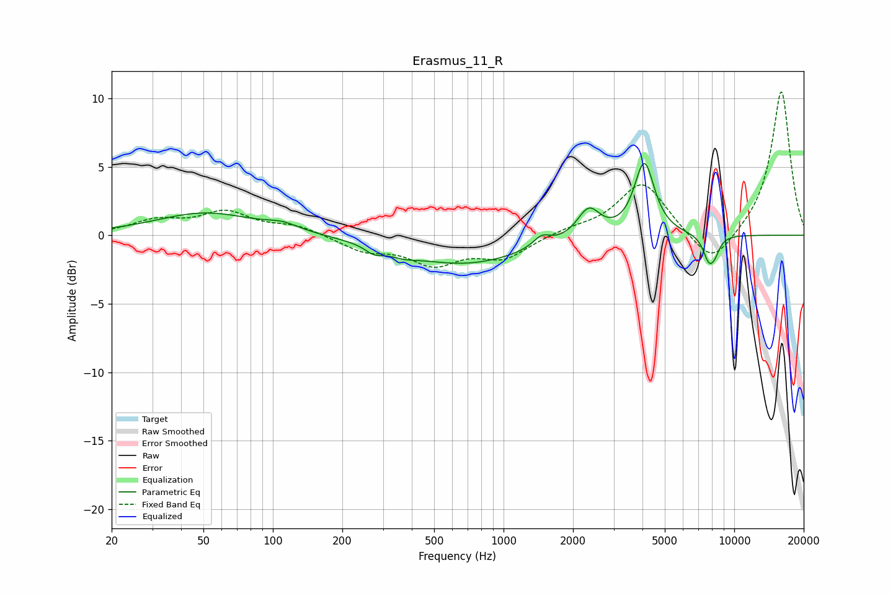

# Erasmus_11_R
See [usage instructions](https://github.com/jaakkopasanen/AutoEq#usage) for more options and info.

### Parametric EQs
Apply preamp of -5.3 dB when using parametric equalizer.

|   # | Type    |   Fc (Hz) |    Q |   Gain (dB) |
|-----|---------|-----------|------|-------------|
|   1 | Peaking |        51 | 0.66 |         1.6 |
|   2 | Peaking |       110 | 2.01 |         0.5 |
|   3 | Peaking |       274 | 3.81 |        -0.5 |
|   4 | Peaking |       364 | 2.22 |        -0.4 |
|   5 | Peaking |       677 | 0.54 |        -2.1 |
|   6 | Peaking |      1464 | 3.81 |         0.8 |
|   7 | Peaking |      2338 | 2.87 |         2.1 |
|   8 | Peaking |      4075 | 3.27 |         5.3 |
|   9 | Peaking |      7769 | 5.26 |        -1.8 |
|  10 | Peaking |      8255 | 6    |        -0.8 |

### Fixed Band EQs
When using fixed band (also called graphic) equalizer, apply preamp of **-10.6 dB** (if available) and set gains manually with these parameters.

|   # | Type    |   Fc (Hz) |    Q |   Gain (dB) |
|-----|---------|-----------|------|-------------|
|   1 | Peaking |        31 | 1.41 |         1   |
|   2 | Peaking |        62 | 1.41 |         1.6 |
|   3 | Peaking |       125 | 1.41 |         0.7 |
|   4 | Peaking |       250 | 1.41 |        -1   |
|   5 | Peaking |       500 | 1.41 |        -1.9 |
|   6 | Peaking |      1000 | 1.41 |        -1.6 |
|   7 | Peaking |      2000 | 1.41 |         0.4 |
|   8 | Peaking |      4000 | 1.41 |         3.9 |
|   9 | Peaking |      8000 | 1.41 |        -2.5 |
|  10 | Peaking |     16000 | 1.41 |        10.6 |

### Graphs

