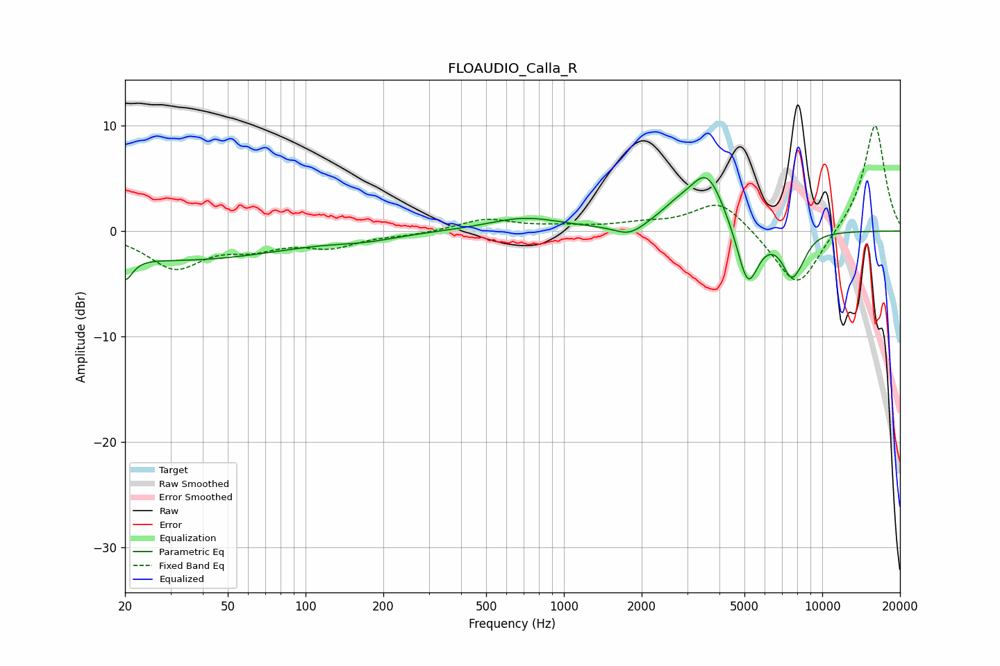

# FLOAUDIO_Calla_R
See [usage instructions](https://github.com/jaakkopasanen/AutoEq#usage) for more options and info.

### Parametric EQs
Apply preamp of -5.2 dB when using parametric equalizer.

|   # | Type    |   Fc (Hz) |    Q |   Gain (dB) |
|-----|---------|-----------|------|-------------|
|   1 | Peaking |        20 | 5.09 |        -2.2 |
|   2 | Peaking |        33 | 0.35 |        -2.7 |
|   3 | Peaking |       173 | 1.17 |        -0.5 |
|   4 | Peaking |       704 | 1    |         1.2 |
|   5 | Peaking |      1794 | 2.5  |        -1   |
|   6 | Peaking |      2713 | 1.96 |         1.2 |
|   7 | Peaking |      3585 | 2    |         5.3 |
|   8 | Peaking |      5150 | 3.29 |        -5.8 |
|   9 | Peaking |      7586 | 3.55 |        -3.7 |
|  10 | Peaking |      8321 | 4.09 |        -1   |

### Fixed Band EQs
When using fixed band (also called graphic) equalizer, apply preamp of **-10.1 dB** (if available) and set gains manually with these parameters.

|   # | Type    |   Fc (Hz) |    Q |   Gain (dB) |
|-----|---------|-----------|------|-------------|
|   1 | Peaking |        31 | 1.41 |        -3.4 |
|   2 | Peaking |        62 | 1.41 |        -1.3 |
|   3 | Peaking |       125 | 1.41 |        -1.4 |
|   4 | Peaking |       250 | 1.41 |        -0.3 |
|   5 | Peaking |       500 | 1.41 |         1.1 |
|   6 | Peaking |      1000 | 1.41 |         0.3 |
|   7 | Peaking |      2000 | 1.41 |         0.5 |
|   8 | Peaking |      4000 | 1.41 |         3   |
|   9 | Peaking |      8000 | 1.41 |        -5.7 |
|  10 | Peaking |     16000 | 1.41 |        10.3 |

### Graphs

