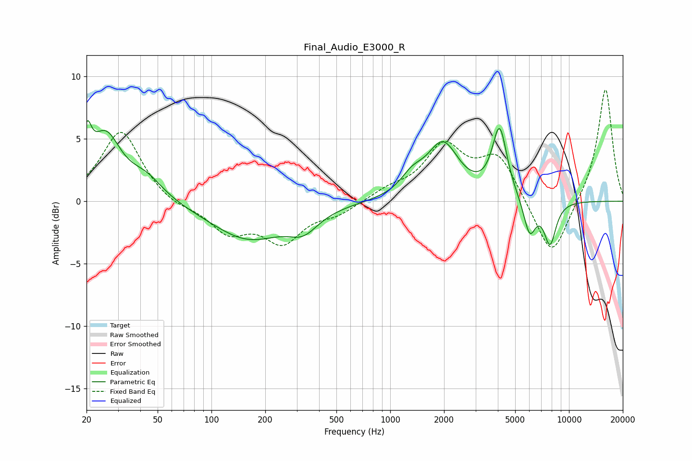

# Final_Audio_E3000_R
See [usage instructions](https://github.com/jaakkopasanen/AutoEq#usage) for more options and info.

### Parametric EQs
Apply preamp of -6.6 dB when using parametric equalizer.

|   # | Type    |   Fc (Hz) |    Q |   Gain (dB) |
|-----|---------|-----------|------|-------------|
|   1 | Peaking |        20 | 5.84 |         3.2 |
|   2 | Peaking |        26 | 1.65 |         5   |
|   3 | Peaking |        43 | 1.49 |         1.6 |
|   4 | Peaking |       160 | 0.68 |        -3   |
|   5 | Peaking |       327 | 1.72 |        -1.5 |
|   6 | Peaking |      1324 | 2.18 |         1.3 |
|   7 | Peaking |      1972 | 1.59 |         4.4 |
|   8 | Peaking |      4090 | 3.44 |         5.6 |
|   9 | Peaking |      6025 | 4    |        -2.9 |
|  10 | Peaking |      7832 | 3.93 |        -3.4 |

### Fixed Band EQs
When using fixed band (also called graphic) equalizer, apply preamp of **-9.0 dB** (if available) and set gains manually with these parameters.

|   # | Type    |   Fc (Hz) |    Q |   Gain (dB) |
|-----|---------|-----------|------|-------------|
|   1 | Peaking |        31 | 1.41 |         5.7 |
|   2 | Peaking |        62 | 1.41 |        -0.5 |
|   3 | Peaking |       125 | 1.41 |        -2.3 |
|   4 | Peaking |       250 | 1.41 |        -3.1 |
|   5 | Peaking |       500 | 1.41 |        -0.9 |
|   6 | Peaking |      1000 | 1.41 |         0.8 |
|   7 | Peaking |      2000 | 1.41 |         4.2 |
|   8 | Peaking |      4000 | 1.41 |         3.5 |
|   9 | Peaking |      8000 | 1.41 |        -4.8 |
|  10 | Peaking |     16000 | 1.41 |         9.2 |

### Graphs

