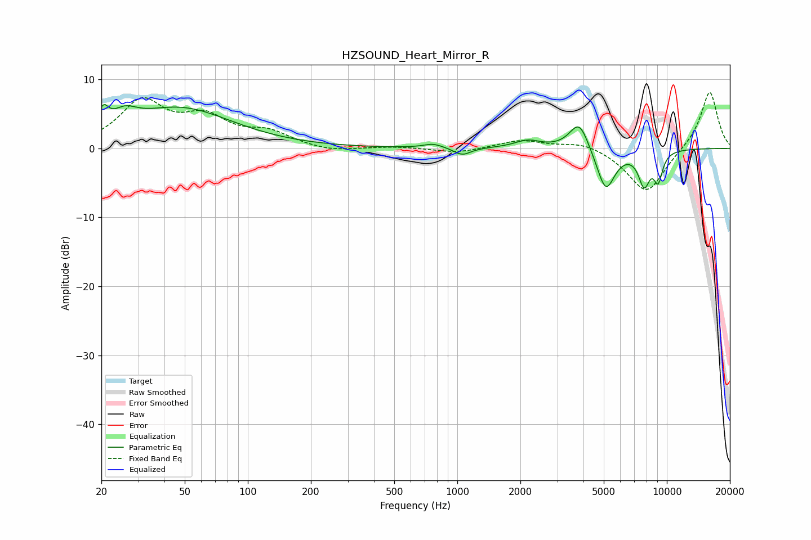

# HZSOUND_Heart_Mirror_R
See [usage instructions](https://github.com/jaakkopasanen/AutoEq#usage) for more options and info.

### Parametric EQs
Apply preamp of -6.4 dB when using parametric equalizer.

|   # | Type    |   Fc (Hz) |    Q |   Gain (dB) |
|-----|---------|-----------|------|-------------|
|   1 | Peaking |        20 | 5.89 |         2.7 |
|   2 | Peaking |        26 | 2.39 |         2.1 |
|   3 | Peaking |        47 | 0.56 |         5.7 |
|   4 | Peaking |       767 | 3.06 |         0.6 |
|   5 | Peaking |      1056 | 3.51 |        -1.1 |
|   6 | Peaking |      2165 | 2.3  |         1.1 |
|   7 | Peaking |      3819 | 3.05 |         4.3 |
|   8 | Peaking |      5110 | 3.15 |        -6.2 |
|   9 | Peaking |      7795 | 4.78 |        -4.8 |
|  10 | Peaking |      9090 | 6    |        -4   |

### Fixed Band EQs
When using fixed band (also called graphic) equalizer, apply preamp of **-8.2 dB** (if available) and set gains manually with these parameters.

|   # | Type    |   Fc (Hz) |    Q |   Gain (dB) |
|-----|---------|-----------|------|-------------|
|   1 | Peaking |        31 | 1.41 |         6.5 |
|   2 | Peaking |        62 | 1.41 |         3.9 |
|   3 | Peaking |       125 | 1.41 |         2   |
|   4 | Peaking |       250 | 1.41 |        -0.6 |
|   5 | Peaking |       500 | 1.41 |         0.2 |
|   6 | Peaking |      1000 | 1.41 |        -0.7 |
|   7 | Peaking |      2000 | 1.41 |         1.2 |
|   8 | Peaking |      4000 | 1.41 |         1   |
|   9 | Peaking |      8000 | 1.41 |        -6.6 |
|  10 | Peaking |     16000 | 1.41 |         8.5 |

### Graphs

