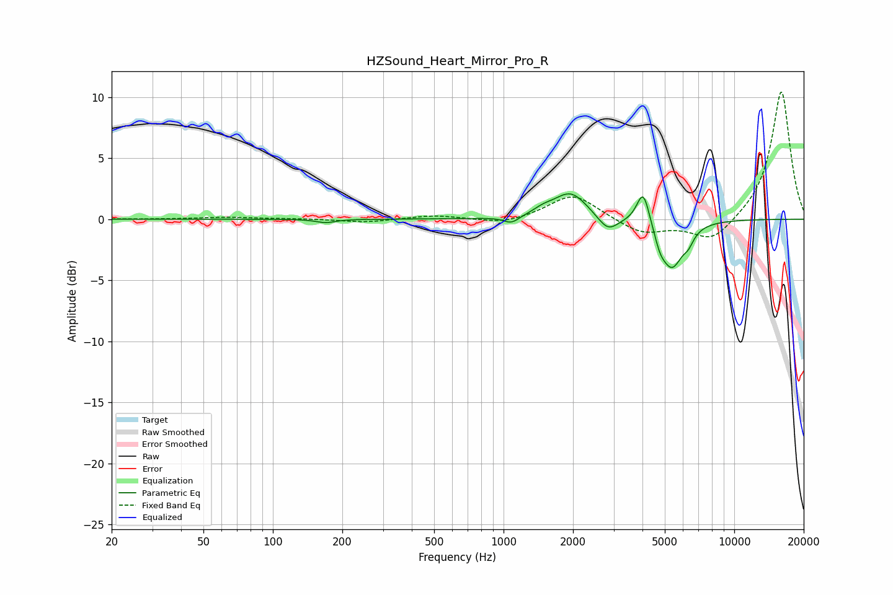

# HZSound_Heart_Mirror_Pro_R
See [usage instructions](https://github.com/jaakkopasanen/AutoEq#usage) for more options and info.

### Parametric EQs
Apply preamp of -2.2 dB when using parametric equalizer.

|   # | Type    |   Fc (Hz) |    Q |   Gain (dB) |
|-----|---------|-----------|------|-------------|
|   1 | Peaking |       170 | 3.39 |        -0.3 |
|   2 | Peaking |      1082 | 4.16 |        -0.6 |
|   3 | Peaking |      1483 | 3.27 |         0.4 |
|   4 | Peaking |      1953 | 1.93 |         2.2 |
|   5 | Peaking |      2833 | 3.19 |        -1.3 |
|   6 | Peaking |      3981 | 3.95 |         0.6 |
|   7 | Peaking |      4040 | 5.41 |         2.3 |
|   8 | Peaking |      4766 | 6    |        -0.9 |
|   9 | Peaking |      5360 | 2.85 |        -3.9 |
|  10 | Peaking |      6328 | 6    |        -0.8 |

### Fixed Band EQs
When using fixed band (also called graphic) equalizer, apply preamp of **-10.5 dB** (if available) and set gains manually with these parameters.

|   # | Type    |   Fc (Hz) |    Q |   Gain (dB) |
|-----|---------|-----------|------|-------------|
|   1 | Peaking |        31 | 1.41 |        -0   |
|   2 | Peaking |        62 | 1.41 |         0.2 |
|   3 | Peaking |       125 | 1.41 |         0   |
|   4 | Peaking |       250 | 1.41 |        -0.3 |
|   5 | Peaking |       500 | 1.41 |         0.3 |
|   6 | Peaking |      1000 | 1.41 |        -0.5 |
|   7 | Peaking |      2000 | 1.41 |         2.1 |
|   8 | Peaking |      4000 | 1.41 |        -1.2 |
|   9 | Peaking |      8000 | 1.41 |        -1.9 |
|  10 | Peaking |     16000 | 1.41 |        10.6 |

### Graphs

