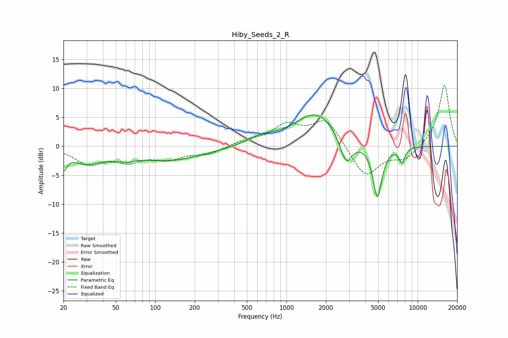

# Hiby_Seeds_2_R
See [usage instructions](https://github.com/jaakkopasanen/AutoEq#usage) for more options and info.

### Parametric EQs
Apply preamp of -5.5 dB when using parametric equalizer.

|   # | Type    |   Fc (Hz) |    Q |   Gain (dB) |
|-----|---------|-----------|------|-------------|
|   1 | Peaking |        20 | 5.89 |        -2.7 |
|   2 | Peaking |        30 | 1.17 |        -2.6 |
|   3 | Peaking |        56 | 3.45 |         1.8 |
|   4 | Peaking |        56 | 2.74 |        -2.6 |
|   5 | Peaking |       129 | 0.54 |        -2.4 |
|   6 | Peaking |       647 | 1.33 |         1.2 |
|   7 | Peaking |      1690 | 0.85 |         5.8 |
|   8 | Peaking |      2849 | 2.93 |        -5   |
|   9 | Peaking |      4933 | 3.99 |        -9.3 |
|  10 | Peaking |      7586 | 5.9  |        -2.6 |

### Fixed Band EQs
When using fixed band (also called graphic) equalizer, apply preamp of **-10.6 dB** (if available) and set gains manually with these parameters.

|   # | Type    |   Fc (Hz) |    Q |   Gain (dB) |
|-----|---------|-----------|------|-------------|
|   1 | Peaking |        31 | 1.41 |        -2.9 |
|   2 | Peaking |        62 | 1.41 |        -2.2 |
|   3 | Peaking |       125 | 1.41 |        -1.9 |
|   4 | Peaking |       250 | 1.41 |        -1.3 |
|   5 | Peaking |       500 | 1.41 |         0.8 |
|   6 | Peaking |      1000 | 1.41 |         3.4 |
|   7 | Peaking |      2000 | 1.41 |         4.7 |
|   8 | Peaking |      4000 | 1.41 |        -5.5 |
|   9 | Peaking |      8000 | 1.41 |        -2.2 |
|  10 | Peaking |     16000 | 1.41 |        10.8 |

### Graphs

