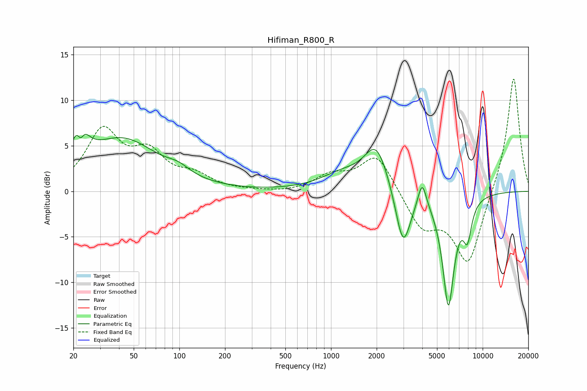

# Hifiman_R800_R
See [usage instructions](https://github.com/jaakkopasanen/AutoEq#usage) for more options and info.

### Parametric EQs
Apply preamp of -6.3 dB when using parametric equalizer.

|   # | Type    |   Fc (Hz) |    Q |   Gain (dB) |
|-----|---------|-----------|------|-------------|
|   1 | Peaking |        22 | 3.31 |         5.7 |
|   2 | Peaking |        22 | 5.98 |        -3.1 |
|   3 | Peaking |        42 | 0.6  |         5.6 |
|   4 | Peaking |        99 | 1.96 |         0.8 |
|   5 | Peaking |      1180 | 0.99 |         1.6 |
|   6 | Peaking |      1995 | 1.75 |         4.9 |
|   7 | Peaking |      2988 | 2.79 |        -6.6 |
|   8 | Peaking |      3991 | 5.04 |         2.9 |
|   9 | Peaking |      5944 | 3.46 |       -12.3 |
|  10 | Peaking |      7936 | 4.81 |        -3.7 |

### Fixed Band EQs
When using fixed band (also called graphic) equalizer, apply preamp of **-12.4 dB** (if available) and set gains manually with these parameters.

|   # | Type    |   Fc (Hz) |    Q |   Gain (dB) |
|-----|---------|-----------|------|-------------|
|   1 | Peaking |        31 | 1.41 |         6.4 |
|   2 | Peaking |        62 | 1.41 |         3.6 |
|   3 | Peaking |       125 | 1.41 |         1.5 |
|   4 | Peaking |       250 | 1.41 |         0   |
|   5 | Peaking |       500 | 1.41 |        -0.2 |
|   6 | Peaking |      1000 | 1.41 |         1.6 |
|   7 | Peaking |      2000 | 1.41 |         4.2 |
|   8 | Peaking |      4000 | 1.41 |        -3.9 |
|   9 | Peaking |      8000 | 1.41 |        -8   |
|  10 | Peaking |     16000 | 1.41 |        12.9 |

### Graphs

