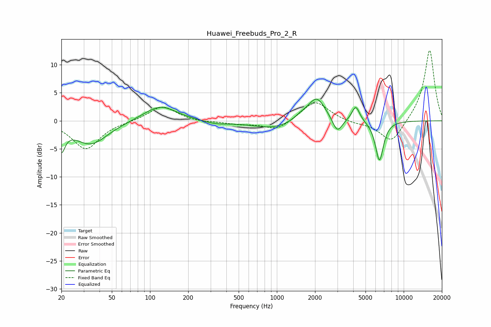

# Huawei_Freebuds_Pro_2_R
See [usage instructions](https://github.com/jaakkopasanen/AutoEq#usage) for more options and info.

### Parametric EQs
Apply preamp of -3.9 dB when using parametric equalizer.

|   # | Type    |   Fc (Hz) |    Q |   Gain (dB) |
|-----|---------|-----------|------|-------------|
|   1 | Peaking |        20 | 5    |        -4   |
|   2 | Peaking |        34 | 1.06 |        -4.2 |
|   3 | Peaking |       120 | 1.1  |         2.8 |
|   4 | Peaking |       328 | 1.37 |        -0.6 |
|   5 | Peaking |       936 | 0.85 |        -1.4 |
|   6 | Peaking |      1541 | 2.62 |         0.7 |
|   7 | Peaking |      2060 | 2.04 |         4.3 |
|   8 | Peaking |      2996 | 3.73 |        -2.7 |
|   9 | Peaking |      4187 | 4.51 |         2.8 |
|  10 | Peaking |      6434 | 4.28 |        -7.2 |

### Fixed Band EQs
When using fixed band (also called graphic) equalizer, apply preamp of **-12.6 dB** (if available) and set gains manually with these parameters.

|   # | Type    |   Fc (Hz) |    Q |   Gain (dB) |
|-----|---------|-----------|------|-------------|
|   1 | Peaking |        31 | 1.41 |        -5   |
|   2 | Peaking |        62 | 1.41 |        -0.1 |
|   3 | Peaking |       125 | 1.41 |         2.7 |
|   4 | Peaking |       250 | 1.41 |        -0.3 |
|   5 | Peaking |       500 | 1.41 |        -0.5 |
|   6 | Peaking |      1000 | 1.41 |        -1.7 |
|   7 | Peaking |      2000 | 1.41 |         3.7 |
|   8 | Peaking |      4000 | 1.41 |        -0.4 |
|   9 | Peaking |      8000 | 1.41 |        -4.1 |
|  10 | Peaking |     16000 | 1.41 |        12.8 |

### Graphs

